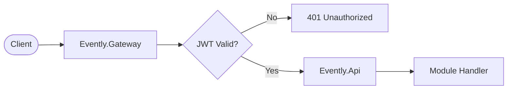

# API Gateway

> **API Gateway:** A specialized reverse proxy that acts as the single entry point for all client traffic to the backend.

-> Centralizing routing, authentication, and cross-cutting concerns so individual modules never implement them.

---

## What It Is

An **API Gateway** sits in front of `Evently.Api` and applies cross-cutting concerns to every request before anything reaches a module: routing, JWT validation, authorization, load balancing, rate limiting, and caching.

It holds no business logic and owns no domain state. Its only job is to inspect, validate, and forward.

In Evently, the gateway is a standalone ASP.NET Core host (`Evently.Gateway`) backed by **YARP** (Yet Another Reverse Proxy), Microsoft's composable reverse proxy library.



---

## Project Setup

The gateway is a separate deployable unit from `Evently.Api`. It has its own `Program.cs`, its own Docker image, and its own ports (3000 for HTTP, 3001 for HTTPS in local dev).

`src/API/Evently.Gateway/Evently.Gateway.csproj`

```xml
<PackageReference Include="Yarp.ReverseProxy" Version="2.1.0" />
<PackageReference Include="Microsoft.AspNetCore.Authentication.JwtBearer" Version="8.0.4" />
```

YARP is the routing engine. JWT Bearer is loaded separately to enforce auth at the gateway boundary before requests are forwarded downstream.

---

## Reverse Proxy Configuration

YARP loads its routing table from `appsettings.json` via `LoadFromConfig`. Each **route** maps a path pattern to a cluster and an optional authorization policy. Each **cluster** defines the downstream address.

`src/API/Evently.Gateway/Program.cs`

```csharp
builder.Services.AddReverseProxy()
    .LoadFromConfig(builder.Configuration.GetSection("ReverseProxy"));
```

`src/API/Evently.Gateway/appsettings.Development.json`

```json
"ReverseProxy": {
  "Routes": {
    "evently-route1": {
      "ClusterId": "evently-cluster",
      "AuthorizationPolicy": "default",
      "Match": { "Path": "{**catch-all}" },
      "Transforms": [ { "PathPattern": "{**catch-all}" } ]
    },
    "evently-route2": {
      "ClusterId": "evently-cluster",
      "AuthorizationPolicy": "anonymous",
      "Match": { "Path": "users/register" }
    }
  },
  "Clusters": {
    "evently-cluster": {
      "Destinations": {
        "destination1": { "Address": "http://evently.api:8080" }
      }
    }
  }
}
```

`evently-route1` catches all paths and requires a valid JWT. `evently-route2` exempts `users/register` from auth. YARP matches more specific routes before the catch-all. The cluster address points to `evently.api:8080`, the internal Docker name of the backend host.

---

## Authentication and Authorization

The gateway validates JWTs issued by **Keycloak** before forwarding any request. Modules trust the gateway and never re-validate.

`src/API/Evently.Gateway/Authentication/JwtBearerConfigureOptions.cs`

```csharp
internal sealed class JwtBearerConfigureOptions(IConfiguration configuration)
    : IConfigureNamedOptions<JwtBearerOptions>
{
    private const string ConfigurationSectionName = "Authentication";

    public void Configure(JwtBearerOptions options)
    {
        configuration.GetSection(ConfigurationSectionName).Bind(options);
    }

    public void Configure(string? name, JwtBearerOptions options) => Configure(options);
}
```

The `Authentication` block points the handler at the Keycloak realm's OIDC discovery document:

`src/API/Evently.Gateway/appsettings.Development.json`

```json
"Authentication": {
  "Audience": "account",
  "TokenValidationParameters": {
    "ValidIssuers": [
      "http://evently.identity:8080/realms/evently",
      "http://localhost:18080/realms/evently"
    ]
  },
  "MetadataAddress": "http://evently.identity:8080/realms/evently/.well-known/openid-configuration",
  "RequireHttpsMetadata": false
}
```

Two issuers are listed so the same config works from inside Docker and from the host machine.

---

## Observability

Every forwarded request stamps its active `TraceId` into the Serilog log context via `LogContextTraceLoggingMiddleware`.

`src/API/Evently.Gateway/Middleware/LogContextTraceLoggingMiddleware.cs`

```csharp
internal sealed class LogContextTraceLoggingMiddleware(RequestDelegate next)
{
    public Task Invoke(HttpContext context)
    {
        string traceId = Activity.Current?.TraceId.ToString();

        using (LogContext.PushProperty("TraceId", traceId))
        {
            return next.Invoke(context);
        }
    }
}
```

OpenTelemetry traces YARP's forwarding pipeline by registering `"Yarp.ReverseProxy"` as an `ActivitySource`:

`src/API/Evently.Gateway/Program.cs`

```csharp
tracing
    .AddAspNetCoreInstrumentation()
    .AddHttpClientInstrumentation()
    .AddSource("Yarp.ReverseProxy");
```

Traces export to Jaeger via OTLP at the address in `OTEL_EXPORTER_OTLP_ENDPOINT`.

---

## Docker Setup

The gateway has its own service in `docker-compose.yml` listening on ports 3000 and 3001 on the host.

`docker-compose.yml`

```yaml
evently.gateway:
  image: ${DOCKER_REGISTRY-}eventlygateway
  container_name: Evently.Gateway
  build:
    context: .
    dockerfile: src/API/Evently.Gateway/Dockerfile
  ports:
    - 3000:8080
    - 3001:8081
```

`docker-compose.override.yml`

```yaml
evently.gateway:
  environment:
    - ASPNETCORE_ENVIRONMENT=Development
    - ASPNETCORE_HTTP_PORTS=8080
    - ASPNETCORE_HTTPS_PORTS=8081
  ports:
    - "8080"
    - "8081"
  volumes:
    - ${APPDATA}/Microsoft/UserSecrets:/home/app/.microsoft/usersecrets:ro
    - ${APPDATA}/ASP.NET/Https:/home/app/.aspnet/https:ro
```
