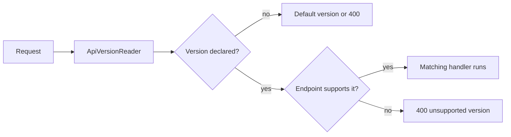

# API Versioning

> **API Version:** A declared revision of an endpoint contract that lets clients keep calling the shape they integrated against while the API evolves.

-> Shipping breaking changes to an API without breaking the clients that already depend on it.

---

## Why Versioning Exists

An endpoint contract is frozen the moment an external client depends on it. Additive changes are safe. Everything else needs a new version running next to the old one.

| Change | Breaking |
|---|---|
| Adding an optional field to a response | No |
| Adding a new endpoint | No |
| Renaming or removing a field | Yes |
| Changing a field type or its semantics | Yes |
| Tightening validation or changing defaults | Yes |

**Asp.Versioning** is the standard library for this in .NET, with roughly 800 million downloads across its packages. Version 10 is the first release supporting .NET 10 and the built in Microsoft OpenAPI library. The programming model is the same on .NET 8, which is what Evently runs today.

---

## Packages

| API style | Packages |
|---|---|
| Controllers | `Asp.Versioning.Mvc`, `Asp.Versioning.Mvc.ApiExplorer` |
| Minimal APIs | `Asp.Versioning.Http`, `Asp.Versioning.Mvc.ApiExplorer` |
| OpenAPI documents per version | `Asp.Versioning.OpenApi` |

Evently maps endpoints through minimal APIs (`IEndpoint`), so `Asp.Versioning.Http` is the relevant entry point.

---

## Reading the Version From the Request

The **ApiVersionReader** decides where the client declares the version.

| Strategy | Request shape | Reader |
|---|---|---|
| Query string (default) | `/api/users?api-version=1.0` | `QueryStringApiVersionReader` |
| URL segment | `/api/v1/users` | `UrlSegmentApiVersionReader` |
| Header | `X-API-Version: 1.0` | `HeaderApiVersionReader` |
| Media type | `Accept: application/json; v=1.0` | `MediaTypeApiVersionReader` |

Strategies can coexist:

`Program.cs`

```csharp
builder.Services.AddApiVersioning(options =>
{
    options.ApiVersionReader = ApiVersionReader.Combine(
        new QueryStringApiVersionReader("api-version"),
        new HeaderApiVersionReader("X-API-Version"));
});
```



---

## Default Version

Clients forget to send versions. Decide what happens when they do:

`Program.cs`

```csharp
builder.Services.AddApiVersioning(options =>
{
    options.DefaultApiVersion = new ApiVersion(1, 0);
    options.AssumeDefaultVersionWhenUnspecified = true;
});
```

-> Changing the default version later silently changes behavior for every client that never declared one. Treat the default as part of the contract.

---

## Versioning Minimal API Endpoints

`NewVersionedApi` creates a logical API, `MapGroup` plus `HasApiVersion` pins each route group to a version:

`Program.cs`

```csharp
var usersApi = app.NewVersionedApi("Users");

RouteGroupBuilder usersV1 = usersApi.MapGroup("api/users").HasApiVersion("1.0");
RouteGroupBuilder usersV2 = usersApi.MapGroup("api/users").HasApiVersion("2.0");

usersV1.MapGet("", () => TypedResults.Ok(new[]
{
    new UserV1(1, "John Doe"),
    new UserV1(2, "Alice Dewett"),
}));

usersV2.MapGet("", () => TypedResults.Ok(new[]
{
    new UserV2(1, "John Doe", new DateOnly(1990, 1, 1)),
    new UserV2(2, "Alice Dewett", new DateOnly(1992, 2, 2)),
}));
```

Both groups share the same route. The version reader picks which handler runs. As versions accumulate, extension methods keep the composition readable and the host focused:

`Program.cs`

```csharp
app.MapUsers().ToV1().ToV2().ToV3();
app.MapScores().ToV1().ToV2().ToV3();
```

-> In Evently the natural seam is `MapEndpoints`. Handing each module's `IEndpoint` a versioned `RouteGroupBuilder` instead of the raw app versions a whole module in one place.

---

## Versioning Controllers

Two controllers share a route and declare their version with an attribute:

`Controllers/UsersV1Controller.cs`

```csharp
[ApiController]
[Route("api/users")]
[ApiVersion("1.0")]
public class UsersV1Controller : ControllerBase
{
    [HttpGet]
    public ActionResult<UserV1[]> Get() =>
        Ok(new[] { new UserV1(1, "John Doe") });
}

[ApiController]
[Route("api/users")]
[ApiVersion("2.0")]
public class UsersV2Controller : ControllerBase
{
    [HttpGet]
    public ActionResult<UserV2[]> Get() =>
        Ok(new[] { new UserV2(1, "John Doe", new DateOnly(1990, 1, 1)) });
}
```

`Program.cs`

```csharp
builder.Services.AddControllers();
builder.Services.AddApiVersioning().AddMvc();
```

---

## One OpenAPI Document Per Version

.NET 10 with `Asp.Versioning.OpenApi` generates a separate document per version from one registration:

`Program.cs`

```csharp
builder.Services.AddApiVersioning()
    .AddApiExplorer(options =>
    {
        options.GroupNameFormat = "'v'VVV";
    })
    .AddOpenApi();

WebApplication app = builder.Build();

app.MapOpenApi().WithDocumentPerVersion();
```

Three rules make this work. `AddApiExplorer` comes after `AddApiVersioning`. `AddOpenApi()` must be the variant from the `Asp.Versioning` namespace, not the one from `Microsoft.AspNetCore`. `WithDocumentPerVersion()` replaces the old v8 pattern of calling `AddOpenApi("v1")` once per version, which removes the duplication.

A UI on top is one loop over the described versions. SwaggerUI, which Evently already ships:

`Program.cs`

```csharp
app.UseSwaggerUI(options =>
{
    foreach (var description in app.DescribeApiVersions().Reverse())
    {
        options.SwaggerEndpoint(
            $"/openapi/{description.GroupName}.json",
            description.GroupName.ToUpperInvariant());
    }
});
```

**Scalar** is the lighter alternative, served at `/scalar` with one `AddDocument` call per described version.

---

## Guarding Versions in CI

| Tool | Job |
|---|---|
| Spectral | Lints OpenAPI documents against style and consistency rules |
| oasdiff | Diffs two OpenAPI documents and fails the build on breaking changes |

-> A version scheme only works when a breaking change cannot ship unnoticed. Diffing the generated documents in the pipeline is the enforcement, not code review.
