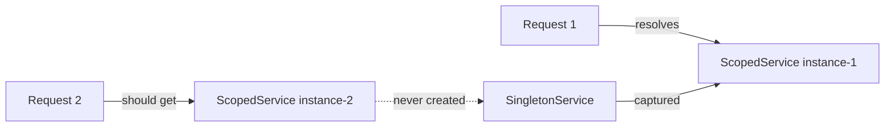

# Captive Dependency Trap

> **Captive Dependency:** A shorter-lived service captured inside a longer-lived one, bypassing its intended disposal boundary.

-> Preventing resource leaks and stale state caused by mismatched DI lifetimes.

---

## DI Lifetimes

.NET's built-in container supports three lifetimes.

| Lifetime | Instance Per | Typical Use |
|---|---|---|
| **Transient** | Every injection site | Lightweight, stateless services |
| **Scoped** | HTTP request | `DbContext`, repositories, unit-of-work |
| **Singleton** | Application lifetime | Caches, configuration, connection pools |

**Transient** services are the safest default. Each consumer gets its own copy, so there is no shared state to worry about. The cost is object allocation on every injection, which matters for heavy objects like `HttpClient` or database connections.

**Scoped** services are created once per HTTP request and shared across all consumers within that request. `DbContext` is the canonical example. Every repository in the same request sees the same change tracker, so `SaveChanges` captures all pending writes in one transaction. Making `DbContext` transient breaks this: each repository gets its own context and calling `SaveChanges` on one will not flush the others.

**Singleton** services live for the entire application lifetime. They are never disposed until the host shuts down. Use them for objects that are expensive to construct and safe to share across all requests, such as in-memory caches, `IConfiguration`, and `IHttpClientFactory`.

---

## Dependency Direction Rules

A service can only depend on services that live at least as long as itself.

| Consumer Lifetime | Allowed Dependencies |
|---|---|
| Singleton | Singleton only |
| Scoped | Scoped, Singleton |
| Transient | Transient, Scoped, Singleton |

---

## The Captive Dependency Trap

The trap occurs when a **Singleton** takes a **Scoped** (or Transient) dependency. The Scoped service is resolved once at the moment the Singleton is first constructed, then held for the rest of the application's lifetime.



`ScopedService instance-1` is never released. Every subsequent request gets the same stale object. If that service holds a `DbContext`, the change tracker accumulates state across requests. If it holds a database connection, that connection is never returned to the pool.

This is a **silent bug**. The container does not throw. The application continues running. The only symptoms are stale data and slow resource exhaustion.

---

## Detection and Prevention

Enable scope validation in the host builder. This catches captive dependencies at startup rather than in production.

`src/API/Evently.Api/Program.cs`

```csharp
builder.Host.UseDefaultServiceProvider(options =>
{
    options.ValidateScopes = true;
    options.ValidateOnBuild = true;
});
```

`ValidateScopes` throws at runtime if a Singleton resolves a Scoped service. `ValidateOnBuild` runs the check at startup before any request is served.

If a Singleton genuinely needs per-request behavior, inject `IServiceScopeFactory` instead and create a child scope manually.

`src/API/Evently.Api/Program.cs`

```csharp
public class MySingletonService(IServiceScopeFactory scopeFactory)
{
    public async Task DoWorkAsync()
    {
        await using var scope = scopeFactory.CreateAsyncScope();
        var db = scope.ServiceProvider.GetRequiredService<AppDbContext>();
        // db is a fresh Scoped instance, properly disposed at the end of the using block
    }
}
```

-> Never inject a Scoped or Transient service directly into a Singleton. Use `IServiceScopeFactory` when scope-lifetime behavior is required inside a Singleton.
