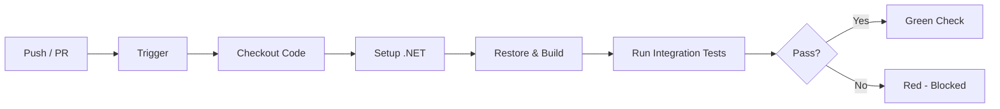

# CI/CD Automated Tests

> **Continuous Integration:** A practice where every code change triggers an automated pipeline that builds and tests the codebase, giving the team immediate confidence in each commit.

-> Catching broken tests and regressions before they reach production.

---

## Why Automate Tests in CI/CD

Two distinct concerns drive the value.

**Immediate feedback** exposes failures the moment they are introduced. A broken test after a refactor surfaces within minutes. The team can fix it while the context is still fresh instead of discovering the problem days later during a code review or QA pass.

**Regression testing** verifies that existing behavior holds after a code change. Running the full test suite on every commit acts as a safety net for both functional correctness and non-functional requirements.

-> The cost of a broken test caught in CI is a fix. The cost of a broken test caught in production is an incident.

---

## GitHub Actions

**GitHub Actions** is a CI/CD platform built into GitHub. A **workflow** is defined as a YAML file under `.github/workflows/`. Once committed to the repository, GitHub reads the file and runs the pipeline on every matching event automatically.

A workflow is composed of one or more **jobs**. Each job runs on a fresh virtual machine called a **runner** and executes a sequence of **steps**. Steps can run shell commands or reuse packaged **actions** from the GitHub marketplace.



If any step exits with a non-zero code, the job fails and GitHub marks the commit as blocked.

---

## Example Workflow

This workflow runs the full integration test suite on every push and pull request targeting `main`.

`.github/workflows/integration-tests.yml`

```yaml
name: Integration Tests           # Label shown in the GitHub Actions UI

on:                               # Events that trigger this workflow
  push:
    branches: [main]
  pull_request:
    branches: [main]

jobs:
  integration-tests:              # Job identifier, arbitrary name
    runs-on: ubuntu-latest        # Runner image; Docker is pre-installed here

    steps:
      - name: Checkout            # Clones the repository into the runner filesystem
        uses: actions/checkout@v4

      - name: Setup .NET          # Installs the .NET SDK matching the project target
        uses: actions/setup-dotnet@v4
        with:
          dotnet-version: '8.0.x'

      - name: Restore             # Downloads NuGet packages
        run: dotnet restore

      - name: Build               # Compiles the solution without running tests
        run: dotnet build --no-restore

      - name: Run integration tests   # Testcontainers starts Docker containers internally
        run: dotnet test test/Evently.IntegrationTests --no-build --verbosity normal
```

-> `ubuntu-latest` runners have Docker available by default, so Testcontainers can pull and start containers for PostgreSQL, Redis, and Keycloak with no extra configuration step.
