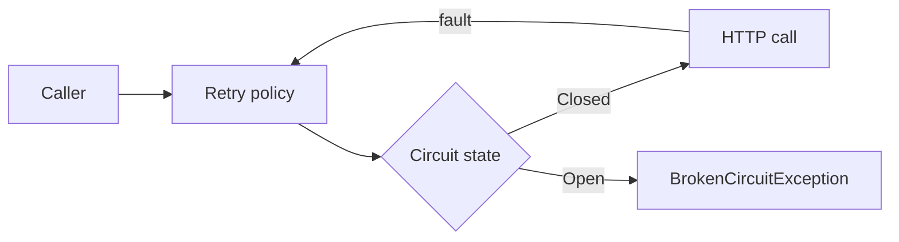

# Circuit Breaker With Polly

> **Defense Barrier:** A mechanism that accepts an operation has failed and blocks further attempts, instead of expecting the next retry to succeed.

-> Pairing Retry and Circuit Breaker on outbound HTTP calls, forcing the circuit open to test it, and operating the breaker on purpose.

---

## Two Patterns, Two Purposes

Transient faults like a slow connection or a timeout correct themselves after a short time. The **Retry pattern** covers them because the next attempt will probably succeed. Other faults come from events that take much longer to fix, from partial connectivity loss to the complete failure of a service. Retrying an operation that is unlikely to succeed wastes resources and adds pressure.

| Pattern | Purpose |
|---|---|
| Retry | Repeat an operation expecting it to eventually succeed |
| Circuit Breaker | Prevent an operation that is likely to fail from running at all |

Careless retries multiply the damage. When a microservice fails or slows down, many clients retrying at once create exponentially increasing traffic against the failing service. That is a denial of service attack built into your own software.

-> The two patterns combine, but the retry logic must be sensitive to the exception the breaker throws and abandon its remaining attempts while the circuit is open.

---

## Wiring Both Policies With IHttpClientFactory

The breaker is one incremental line on top of the retry registration for a typed client:

`Program.cs`

```csharp
IAsyncPolicy<HttpResponseMessage> retryPolicy = GetRetryPolicy();
IAsyncPolicy<HttpResponseMessage> circuitBreakerPolicy = GetCircuitBreakerPolicy();

builder.Services.AddHttpClient<IBasketService, BasketService>()
    .SetHandlerLifetime(TimeSpan.FromMinutes(5))
    .AddHttpMessageHandler<HttpClientAuthorizationDelegatingHandler>()
    .AddPolicyHandler(retryPolicy)
    .AddPolicyHandler(circuitBreakerPolicy);
```

`Program.cs`

```csharp
static IAsyncPolicy<HttpResponseMessage> GetCircuitBreakerPolicy()
{
    return HttpPolicyExtensions
        .HandleTransientHttpError()
        .CircuitBreakerAsync(5, TimeSpan.FromSeconds(30));
}
```

Five consecutive faults open the circuit for 30 seconds. During that window every call fails immediately without touching the network. `HandleTransientHttpError()` treats `HttpRequestException`, HTTP 5xx, and HTTP 408 as faults.



-> Registration order defines nesting. Retry wraps the breaker, so every attempt feeds the failure counter, and once the circuit opens the remaining retries fail instantly.

-> Evently already runs this exact pairing on the **KeyCloakClient**. See `docs/http-circuit-breaker.md` for the module level wiring and the `Result` mapping.

---

## Testing the Open Circuit

A breaker that was never observed open is untested resilience. Two ways to force it.

**Lower the threshold.** Set the allowed faults to 1 and redeploy. While containers are still warming up, dependencies like the database answer slowly or not at all, one failed request opens the circuit, and the failure path becomes visible.

**Simulate failure with middleware.** A small middleware in the downstream service returns status 500 for every request while enabled, toggled from any browser:

| Request | Effect |
|---|---|
| `GET /failing` | Reports whether the simulation is active |
| `GET /failing?enable` | Every subsequent request returns status 500 |
| `GET /failing?disable` | Restores normal behavior |

`Middleware/FailingMiddleware.cs`

```csharp
internal sealed class FailingMiddleware(RequestDelegate next)
{
    private bool _mustFail;

    public async Task InvokeAsync(HttpContext context)
    {
        if (context.Request.Path.StartsWithSegments("/failing"))
        {
            if (context.Request.Query.ContainsKey("enable"))
            {
                _mustFail = true;
            }
            else if (context.Request.Query.ContainsKey("disable"))
            {
                _mustFail = false;
            }

            await context.Response.WriteAsync($"Failing simulation enabled: {_mustFail}");
            return;
        }

        if (_mustFail)
        {
            context.Response.StatusCode = StatusCodes.Status500InternalServerError;
            return;
        }

        await next(context);
    }
}
```

With the simulation enabled the retry policy burns through its attempts, the breaker counts the faults, and the circuit opens. Every caller now receives `BrokenCircuitException` instantly, which is exactly the behavior to verify before trusting the breaker in production.

---

## Reacting to the Open Circuit

The exception must become a business answer, not a stack trace. The Microsoft reference application catches it at the call site and shows the user a friendly message:

`WebMVC/Controllers/CartController.cs`

```csharp
public async Task<IActionResult> Index()
{
    try
    {
        var user = _appUserParser.Parse(HttpContext.User);
        var vm = await _basketSvc.GetBasket(user);
        return View(vm);
    }
    catch (BrokenCircuitException)
    {
        HandleBrokenCircuitException();
    }
    return View();
}

private void HandleBrokenCircuitException()
{
    TempData["BasketInoperativeMsg"] = "Basket Service is inoperative, please try later on.";
}
```

In Evently the same catch translates into a `Result` failure so the Presentation layer returns a 503. An open circuit is also the natural trigger for **fallback infrastructure**. When the primary backend sits in a failing environment, the caller can redirect the request to a redundant backend or another datacenter instead of surfacing an error at all.

---

## Manual Control With Isolate and Reset

Polly exposes two operations for deliberate control of the breaker.

| Operation | Effect |
|---|---|
| `Isolate` | Forces the circuit open and holds it open |
| `Reset` | Closes the circuit again |

A secured utility endpoint that invokes them turns the breaker into an operations tool. Trip the circuit before upgrading a downstream system, reset it when the upgrade is done, and no caller ever waits on a timeout during the maintenance window. The same lever protects a downstream system suspected of faulting.

---

## How This Doc Relates to http-circuit-breaker.md

| Topic | Where |
|---|---|
| Breaker states and the Evently KeyCloakClient wiring | `docs/http-circuit-breaker.md` |
| Retry pairing rationale, failure simulation, fallback, manual control | this doc |
