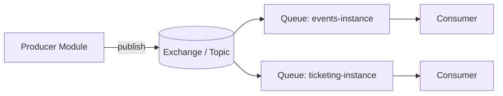

# Distributed Messaging

> **Message Broker:** A central intermediary that accepts messages from producers and holds them in queues until consumers retrieve and process them.

-> Decoupling modules by moving data between them asynchronously over the network instead of through direct calls.

---

## What Is Distributed Messaging

A distributed messaging system decouples services by transiting data asynchronously across the network. **Producers** send messages to a central message broker that stores them temporarily in queues and topics. **Consumers** retrieve and process them on their own schedule. The producer never waits on the consumer and neither needs to know the other exists.

Evently uses **RabbitMQ**, a reliable and widely adopted broker with first-class support in MassTransit. MassTransit keeps the application code transport-agnostic, so consumers and handlers stay the same regardless of the broker underneath.



---

## Docker Infrastructure

RabbitMQ runs as a container. The `management-alpine` image bundles the management UI on port `15672`. Port `5672` is the AMQP protocol port the application connects to.

`docker-compose.yml`

```yaml
evently.queue:
    image: rabbitmq:management-alpine
    container_name: Evently.Queue
    hostname: evently-queue
    volumes:
        - ./.containers/queue/data/:/var/lib/rabbitmq
        - ./.containers/queue/log/:/var/log/rabbitmq
    environment:
        RABBITMQ_DEFAULT_USER: guest
        RABBITMQ_DEFAULT_PASS: guest
    ports:
      - 5672:5672
      - 15672:15672
```

---

## Connection String

The broker endpoint is supplied as an AMQP connection string. The credentials live in `RabbitMqSettings`, so the string only carries the host.

`src/API/Evently.Api/appsettings.json`

```json
"ConnectionStrings": {
  "Database": "",
  "Cache": "",
  "Queue": ""
}
```

`src/API/Evently.Api/appsettings.Development.json`

```json
"Queue": "amqp://evently-queue:5672"
```

-> `evently-queue` is the container hostname. The value is overridden per environment through `ConnectionStrings__Queue`.

---

## NuGet Packages

| Package | Purpose |
|---|---|
| `MassTransit.RabbitMQ` | RabbitMQ transport for MassTransit |
| `AspNetCore.HealthChecks.Rabbitmq` | Health check probe for the broker |

Both are referenced in `src/Common/Evently.Common.Infrastructure/`.

---

## RabbitMqSettings

A record carries the host into the registration call. Username and password default to `guest`, so a local setup needs only the host.

`src/Common/Evently.Common.Infrastructure/EventBus/RabbitMqSettings.cs`

```csharp
namespace Evently.Common.Infrastructure.EventBus;

public sealed record RabbitMqSettings(string Host, string Username = "guest", string Password = "guest");
```

---

## Registering RabbitMQ

The in-memory transport is replaced by `UsingRabbitMq`. `SetKebabCaseEndpointNameFormatter` names every queue, and `ConfigureEndpoints` auto-declares one exchange per Integration Event type and one queue per registered consumer.

`src/Common/Evently.Common.Infrastructure/InfrastructureConfiguration.cs`

```csharp
public static IServiceCollection AddInfrastructure(
    this IServiceCollection services,
    string serviceName,
    Action<IRegistrationConfigurator, string>[] moduleConfigureConsumers,
    RabbitMqSettings rabbitMqSettings,
    string databaseConnectionString,
    string redisConnectionString)
{
    services.AddMassTransit(configure =>
    {
        string instanceId = serviceName.ToLowerInvariant().Replace('.', '-');
        foreach (Action<IRegistrationConfigurator, string> configureConsumers in moduleConfigureConsumers)
        {
            configureConsumers(configure, instanceId);
        }

        configure.SetKebabCaseEndpointNameFormatter();

        configure.UsingRabbitMq((context, cfg) =>
        {
            cfg.Host(new Uri(rabbitMqSettings.Host), h =>
            {
                h.Username(rabbitMqSettings.Username);
                h.Password(rabbitMqSettings.Password);
            });

            cfg.ConfigureEndpoints(context);
        });
    });

    return services;
}
```

---

## Per Service Queues With instanceId

`instanceId` is the service name lowercased with dots replaced by hyphens, for example `evently-api`. It is passed into every module's `ConfigureConsumers` and applied to each consumer endpoint.

`src/Modules/Attendance/Evently.Modules.Attendance.Infrastructure/AttendanceModule.cs`

```csharp
public static void ConfigureConsumers(IRegistrationConfigurator registrationConfigurator, string instanceId)
{
    registrationConfigurator.AddConsumer<IntegrationEventConsumer<EventPublishedIntegrationEvent>>()
        .Endpoint(c => c.InstanceId = instanceId);
}
```

-> The instanceId suffixes the queue name. When a module is deployed as its own service, its queues are uniquely named, so RabbitMQ fans out a copy of each event to every subscribing service instead of letting instances compete on one shared queue.

A module that returns its config as a delegate takes the instanceId as the second lambda parameter.

`src/Modules/Events/Evently.Modules.Events.Infrastructure/EventsModule.cs`

```csharp
public static Action<IRegistrationConfigurator, string> ConfigureConsumers(string redisConnectionString)
{
    return (registration, instanceId) => registration
        .AddSagaStateMachine<CancelEventSaga, CancelEventState>()
        .Endpoint(c => c.InstanceId = instanceId)
        .RedisRepository(redisConnectionString);
}
```

---

## Wiring the Settings

`Program.cs` builds `RabbitMqSettings` from the `Queue` connection string and passes it into `AddInfrastructure`. The broker is also added to the health checks so a down queue surfaces on the `health` endpoint.

`src/API/Evently.Api/Program.cs`

```csharp
var rabbitMqSettings = new RabbitMqSettings(builder.Configuration.GetConnectionStringOrThrow("Queue"));

builder.Services.AddInfrastructure(
    DiagnosticsConfig.ServiceName,
    [
        EventsModule.ConfigureConsumers(redisConnectionString),
        TicketingModule.ConfigureConsumers,
        AttendanceModule.ConfigureConsumers
    ],
    rabbitMqSettings,
    databaseConnectionString,
    redisConnectionString);

builder.Services.AddHealthChecks()
    .AddNpgSql(databaseConnectionString)
    .AddRedis(redisConnectionString)
    .AddRabbitMQ(rabbitConnectionString: rabbitMqSettings.Host)
    .AddKeyCloak(keyCloakHealthUrl);
```
