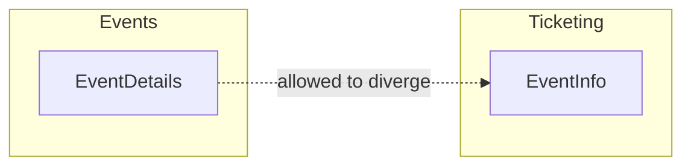

# Don't Repeat Yourself

> **DRY:** Every piece of knowledge must have a single, unambiguous, authoritative representation within a system.

-> Avoiding the wrong abstractions that cost more to unwind than the duplication they replaced.

---

## What DRY Actually Says

The original definition from *The Pragmatic Programmer* says nothing about code. It says: every piece of **knowledge** must have exactly one authoritative representation.

Knowledge is a business rule, a domain fact, a validation constraint that has meaning in your problem domain. When that fact changes, it should change in exactly one place.

Code that looks the same is not the same thing as knowledge that is the same. Two methods with identical bodies can represent completely different concepts. Merging them is not applying DRY. It is creating coupling.

---

## The Mistake: Deduplicating Code, Not Knowledge

In Evently, both the `Events` module and the `Ticketing` module check whether a date is in the future before accepting input. Today the rules are identical:

`src/Modules/Events/Evently.Modules.Events.Application/Events/CreateEvent/CreateEventCommandHandler.cs`

```csharp
private static bool IsValidEventDate(DateTime date) =>
    date > DateTime.UtcNow;
```

`src/Modules/Ticketing/Evently.Modules.Ticketing.Application/TicketTypes/CreateTicketType/CreateTicketTypeCommandHandler.cs`

```csharp
private static bool IsValidSaleDate(DateTime date) =>
    date > DateTime.UtcNow;
```

The **DRY reflex** says to extract one shared validator. But these encode different knowledge: `Events` enforces when an event can be scheduled, `Ticketing` enforces when a sale window can open. When the sales policy adds "must be at least 48 hours before the event", the shared method grows a flag to distinguish callers:

```csharp
private static bool IsValidDate(DateTime date, bool requireLeadTime = false) =>
    date > DateTime.UtcNow &&
    (!requireLeadTime || date > DateTime.UtcNow.AddHours(48));
```

That boolean is the tell. The two concepts were never the same. They only looked alike.

---

## Where It Hurts Most: Across Module Boundaries

Inside one class a bad helper is inconvenient. Across module boundaries it is structural damage.

Both `Events` and `Ticketing` model an event. A well-meaning engineer notices the two representations share fields and pulls them into a shared type:

`src/Common/Evently.Common.Application/SharedModels/EventSummary.cs`

```csharp
// referenced by both Events and Ticketing
public class EventSummary
{
    public Guid Id { get; set; }
    public string Title { get; set; }
    public DateTime StartsAt { get; set; }
    public decimal TicketPrice { get; set; }
}
```

Now `Events` and `Ticketing` cannot evolve independently. Adding `VenueCapacity` needed only by `Events` forces a recompile and redeploy of `Ticketing`. Removing `TicketPrice` from the events side breaks `Ticketing`.

-> Each module must own its own representation of the same real-world concept.



The shapes are similar and are allowed to be. They model the same real-world thing from two bounded contexts that will drift over time. Modules communicate through Integration Events, not shared types.

---

## The Wrong Abstraction Costs More

**Duplication** is visible and local. You can see both copies. If they drift apart, that drift is intentional and allowed.

The **wrong abstraction** is invisible and global. Every caller bends its interface to fit. Boolean flags pile up. You stop understanding the method. Fixing it means touching every caller.

-> Prefer duplication over the wrong abstraction. A copy-pasted validator that drifts is easier to fix than a shared one that has grown three boolean parameters.

---

## The Rule: Wait for the Third Time

Do not deduplicate the second time you see something. Wait for the third, then ask one question:

-> If this rule changes, do both copies have to change together?

| Answer | What it means | Action |
|---|---|---|
| Yes | Same knowledge, just repeated | Extract it |
| No | Coincidental resemblance | Leave it alone |

A practical signal: extract when you can **name the concept**. `Money`, `TicketCapacity`, `EventDuration` are domain names that signal real knowledge worth a value object. `Helper`, `Utils`, or `ProcessData` signal you are abstracting shape, not knowledge.

---

## When DRY Is Right

Applied to real domain knowledge, DRY is essential.

In Evently, the rule "a published event must have at least one ticket type" must live in exactly one place. Scatter it across the controller, the command handler, and an admin service and one copy will drift:

```csharp
// EventsController
if (event.TicketTypes.Count > 0) { /* allow */ }

// AdminEventService - someone relaxed this to allow drafts through
if (event.TicketTypes.Count >= 0) { /* allow */ }
```

Push it into the domain model where it belongs:

`src/Modules/Events/Evently.Modules.Events.Domain/Events/Event.cs`

```csharp
public bool CanPublish() => TicketTypes.Count > 0;
```

One authoritative check. When the business changes the rule, there is one place to change it.

Value objects apply the same idea to data. `Money` is not a `decimal`. It is a concept with validation and arithmetic rules that belong in one class:

`src/Common/Evently.Common.Domain/ValueObjects/Money.cs`

```csharp
public record Money(decimal Amount, string Currency)
{
    public static Money Of(decimal amount, string currency)
    {
        if (amount < 0) throw new ArgumentException("Amount cannot be negative.");
        if (string.IsNullOrWhiteSpace(currency)) throw new ArgumentException("Currency is required.");
        return new Money(amount, currency);
    }
}
```

Whenever `Money` validation must change, it changes once.

---

## Summary

| Scenario | Guidance |
|---|---|
| Same code, different modules | Own separate representations per module |
| Same code, same module, seen twice | Wait for the third occurrence |
| Business rule scattered across callers | Consolidate into the domain model |
| Shared method growing boolean flags | Delete the abstraction, restore the copies |
