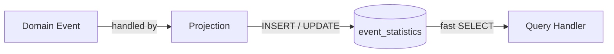

# Materialized Views

> **Regular view:** A logical construct inside the database; it doesn't store any data. Every query against it re-executes the underlying SQL.
>
> **Materialized view:** A simple concept that helps improve querying performance when reading data from a database. A materialized view actually persists the data inside the database.

We can construct a materialized view manually by reacting to events in our domain. In code, this is called a **Projection**.

---

## How It Works

Each Projection is a Domain Event handler whose sole job is to keep the read model in sync. Instead of the database engine refreshing the view, we update the persisted table ourselves as events flow through the system.



---

## Example: `EventStatistics`

The `Attendance` module maintains an `event_statistics` table as a manually managed materialized view. It is written to by a set of Projections and read directly by query handlers, with no joins and no aggregations at query time.

| Event | Projection | Effect on `event_statistics` |
|---|---|---|
| `EventCreatedDomainEvent` | `EventCreatedDomainEventHandler` | `INSERT` creates the row |
| `TicketCreatedDomainEvent` | `TicketCreatedDomainEventHandler` | `UPDATE tickets_sold` |
| `AttendeeCheckedInDomainEvent` | `AttendeeCheckedInDomainEventHandler` | `UPDATE attendees_checked_in` |

---

## Where is this implemented in code?

### 1. The Read Model: `EventStatistics`

`src/Modules/Attendance/Evently.Modules.Attendance.Domain/Events/EventStatistics.cs`

```csharp
public sealed class EventStatistics
{
    public Guid EventId { get; private set; }
    public string Title { get; private set; }
    public string Description { get; private set; }
    public string Location { get; private set; }
    public DateTime StartsAtUtc { get; private set; }
    public DateTime? EndsAtUtc { get; private set; }
    public int TicketsSold { get; private set; }
    public int AttendeesCheckedIn { get; private set; }
    public List<string> DuplicateCheckInTickets { get; private set; }
    public List<string> InvalidCheckInTickets { get; private set; }
}
```

This is a flat, denormalized read model. All the data a consumer needs is already pre-aggregated into a single row, with no joins required at read time.

---

### 2. Projection: `EventCreatedDomainEventHandler`

`src/Modules/Attendance/Evently.Modules.Attendance.Application/EventStatistics/Projections/EventCreatedDomainEventHandler.cs`

```csharp
internal sealed class EventCreatedDomainEventHandler(IDbConnectionFactory dbConnectionFactory)
    : DomainEventHandler<EventCreatedDomainEvent>
{
    public override async Task Handle(
        EventCreatedDomainEvent domainEvent,
        CancellationToken cancellationToken = default)
    {
        await using DbConnection connection = await dbConnectionFactory.OpenConnectionAsync();

        const string sql =
            """
            INSERT INTO attendance.event_statistics(
                event_id, title, description, location,
                starts_at_utc, ends_at_utc,
                tickets_sold, attendees_checked_in,
                duplicate_check_in_tickets, invalid_check_in_tickets)
            VALUES (
                @EventId, @Title, @Description, @Location,
                @StartsAtUtc, @EndsAtUtc,
                @TicketsSold, @AttendeesCheckedIn,
                @DuplicateCheckInTickets, @InvalidCheckInTickets)
            """;

        await connection.ExecuteAsync(sql, new
        {
            domainEvent.EventId, domainEvent.Title, domainEvent.Description,
            domainEvent.Location, domainEvent.StartsAtUtc, domainEvent.EndsAtUtc,
            TicketsSold = 0,
            AttendeesCheckedIn = 0,
            DuplicateCheckInTickets = Array.Empty<string>(),
            InvalidCheckInTickets = Array.Empty<string>()
        });
    }
}
```

When an event is created, the Projection `INSERT`s a new row into `event_statistics` with all counters initialised to zero. Subsequent Projections then `UPDATE` those counters as more events arrive.

---

### 3. Projection: `TicketCreatedDomainEventHandler`

`src/Modules/Attendance/Evently.Modules.Attendance.Application/EventStatistics/Projections/TicketCreatedDomainEventHandler.cs`

```csharp
internal sealed class TicketCreatedDomainEventHandler(IDbConnectionFactory dbConnectionFactory)
    : DomainEventHandler<TicketCreatedDomainEvent>
{
    public override async Task Handle(
        TicketCreatedDomainEvent domainEvent,
        CancellationToken cancellationToken = default)
    {
        await using DbConnection connection = await dbConnectionFactory.OpenConnectionAsync();

        const string sql =
            """
            UPDATE attendance.event_statistics es
            SET tickets_sold = (
                SELECT COUNT(*)
                FROM attendance.tickets t
                WHERE t.event_id = es.event_id)
            WHERE es.event_id = @EventId
            """;

        await connection.ExecuteAsync(sql, domainEvent);
    }
}
```

Every time a ticket is sold, `tickets_sold` is recalculated from the source table and written back into the read model.

---

### 4. Projection: `AttendeeCheckedInDomainEventHandler`

`src/Modules/Attendance/Evently.Modules.Attendance.Application/EventStatistics/Projections/AttendeeCheckedInDomainEventHandler.cs`

```csharp
internal sealed class AttendeeCheckedInDomainEventHandler(IDbConnectionFactory dbConnectionFactory)
    : DomainEventHandler<AttendeeCheckedInDomainEvent>
{
    public override async Task Handle(
        AttendeeCheckedInDomainEvent domainEvent,
        CancellationToken cancellationToken = default)
    {
        await using DbConnection connection = await dbConnectionFactory.OpenConnectionAsync();

        const string sql =
            """
            UPDATE attendance.event_statistics es
            SET attendees_checked_in = (
                SELECT COUNT(*)
                FROM attendance.tickets t
                WHERE
                    t.event_id = es.event_id AND
                    t.used_at_utc IS NOT NULL)
            WHERE es.event_id = @EventId
            """;

        await connection.ExecuteAsync(sql, domainEvent);
    }
}
```

When an attendee checks in, `attendees_checked_in` is recomputed by counting tickets that have a non-null `used_at_utc`.

---

### 5. Reading the View: `GetEventStatisticsQueryHandler`

`src/Modules/Attendance/Evently.Modules.Attendance.Application/EventStatistics/GetEventStatistics/GetEventStatisticsQueryHandler.cs`

```csharp
internal sealed class GetEventStatisticsQueryHandler(IDbConnectionFactory dbConnectionFactory)
    : IQueryHandler<GetEventStatisticsQuery, EventStatisticsResponse>
{
    public async Task<Result<EventStatisticsResponse>> Handle(
        GetEventStatisticsQuery request,
        CancellationToken cancellationToken)
    {
        await using DbConnection connection = await dbConnectionFactory.OpenConnectionAsync();

        const string sql =
            $"""
             SELECT
                 event_id AS {nameof(EventStatisticsResponse.EventId)},
                 title AS {nameof(EventStatisticsResponse.Title)},
                 ...
                 tickets_sold AS {nameof(EventStatisticsResponse.TicketsSold)},
                 attendees_checked_in AS {nameof(EventStatisticsResponse.AttendeesCheckedIn)},
                 ...
             FROM attendance.event_statistics
             WHERE event_id = @EventId
             """;

        EventStatisticsResponse? eventStatistics =
            await connection.QuerySingleOrDefaultAsync<EventStatisticsResponse>(sql, request);

        return eventStatistics is null
            ? Result.Failure<EventStatisticsResponse>(EventErrors.NotFound(request.EventId))
            : eventStatistics;
    }
}
```

The query is a straight `SELECT` against a single, pre-populated table. No aggregations, no joins: the Projections have already done the work.

---

See also: [[event-driven-architecture]], [[outbox-pattern-concept]]
