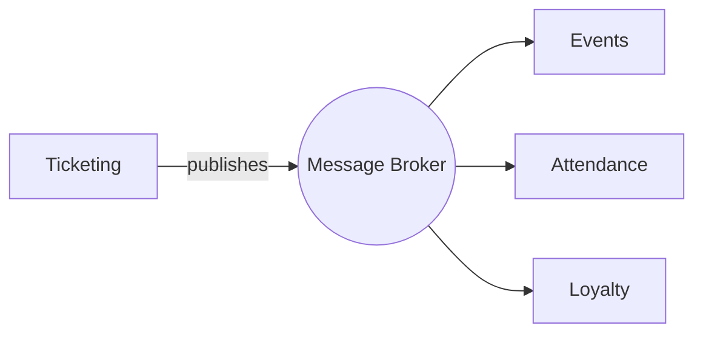
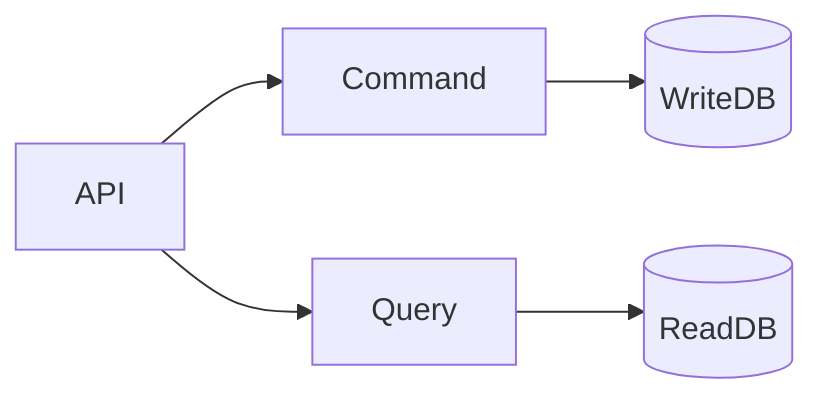

# Event-Driven Architecture

> **Event:** An event is an immutable fact, something that has already happened in the past and cannot be changed.

Event-driven is a concern about something being driven by business events. It's a reactive style of architecture: you react to events instead of explicitly telling the system what to do next.

---

## Patterns of EDA

Your architecture is event-driven if you're using at least one of these patterns.

---

### Event Sourcing

The main responsibility is to manage application state. The concept is based on persisting the individual events as the state of the system, a set of events applied one after the other that defines the current state.

---

### Event Notifications

A notification is a message telling about something that has happened. They are mainly used to tell other components inside the system that something relevant has happened. A notification contains only the data needed for the reactions to occur.

Generally applied using **Domain Events** (Internal Events).

---

### Event-Carried State Transfer

The responsibility is data distribution among various components inside the EDA.

Generally applied using **Integration Events** (Public Events).

---

### CQRS

The act of segregating the read/write database connections logically. Read models in `ReadDB` are updated with projections coming from `WriteDB`. Ideally, operations are segregated into **Command** and **Query** operations.

---

## Domain Events vs. Integration Events

| | Domain Event | Integration Event |
|---|---|---|
| Scope | Internal to the microservice/module | Crosses bounded context/module boundary |
| Audience | Other components within the same module | Other microservices/modules |
| Pattern | Event Notifications | Event-Carried State Transfer |

**Domain events** communicate internally inside a microservice or module.

**Integration events** cross bounded context or module boundaries to communicate with other microservices or modules.

See also: [[outbox-pattern-concept]], [[inbox-pattern-concept]]

---

## When to Use EDA

**Best suited for:**
- Large business applications
- Complex enterprise systems

**Common use cases:**

| Use Case | Description |
|---|---|
| External integration | Decoupling communication with third-party systems |
| Temporal decoupling | Producer and consumer do not need to be available at the same time |
| State transfer | Distributing state changes across module boundaries |
| Workflows | Coordinating multi-step business processes reactively |

---

## Orchestration and Choreography

There are two approaches to planning event chains: Orchestration and Choreography.

> _This section is a work in progress._
