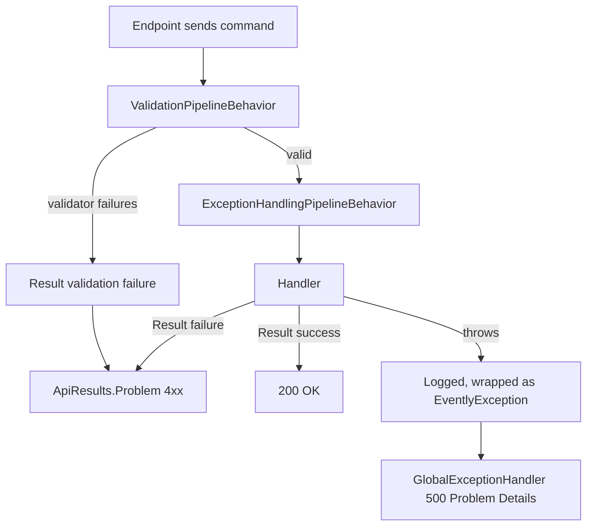

# Exception Handling Strategy

> **Result Over Throw:** Expected failures travel as `Result` values carrying an `Error`, exceptions are reserved for the genuinely unexpected.

-> Guaranteeing every failure leaves the API as a well formed Problem Details response, with business failures never riding on exceptions.

---

## Two Kinds of Failure

| Kind | Examples | Vehicle |
|---|---|---|
| Expected | Invalid input, missing record, business rule conflict | `Result` carrying an `Error` |
| Unexpected | Bug, infrastructure outage, unreachable dependency | Exception |

-> If code can anticipate a failure, the failure is not exceptional. It travels as data, not as control flow.

This split keeps the happy path readable, makes failures type checked instead of invisible, and reserves stack unwinding for situations where no local decision is possible.

---

## The Error Model

Every expected failure is an **Error** with a code, a human description, and a type:

`src/Common/Evently.Common.Domain/Error.cs`

```csharp
public record Error
{
    public string Code { get; }
    public string Description { get; }
    public ErrorType Type { get; }

    public static Error Failure(string code, string description) =>
        new(code, description, ErrorType.Failure);

    public static Error NotFound(string code, string description) =>
        new(code, description, ErrorType.NotFound);

    public static Error Problem(string code, string description) =>
        new(code, description, ErrorType.Problem);

    public static Error Conflict(string code, string description) =>
        new(code, description, ErrorType.Conflict);
}
```

The **ErrorType** is the single source of truth for the HTTP status code:

| ErrorType | Status code |
|---|---|
| Validation | 400 |
| Problem | 400 |
| NotFound | 404 |
| Conflict | 409 |
| Failure | 500 |

---

## From Handler to HTTP Response

Handlers return `Result` or `Result<T>`. Endpoints convert with `Match`, routing failures through `ApiResults.Problem`:

`src/Modules/Events/Evently.Modules.Events.Presentation/Categories/CreateCategory.cs`

```csharp
Result<Guid> result = await sender.Send(new CreateCategoryCommand(request.Name));

return result.Match(Results.Ok, ApiResults.Problem);
```

`ApiResults.Problem` builds an RFC 7231 **Problem Details** body from the error, mapping title, detail, type URI, and status code off the `ErrorType`:

`src/Common/Evently.Common.Presentation/Results/ApiResults.cs`

```csharp
return Microsoft.AspNetCore.Http.Results.Problem(
    title: GetTitle(result.Error),
    detail: GetDetail(result.Error),
    type: GetType(result.Error.Type),
    statusCode: GetStatusCode(result.Error.Type),
    extensions: GetErrors(result));
```

-> One mapping for the whole system. No endpoint decides status codes by hand, and every failure body has the same shape.

---

## Validation Failures Never Throw

**ValidationPipelineBehavior** runs every FluentValidation validator registered for a command before the handler executes. Failures do not throw, they become a `Result` validation failure through reflection on the response type:

`src/Common/Evently.Common.Application/Behaviors/ValidationPipelineBehavior.cs`

```csharp
ValidationFailure[] validationFailures = await ValidateAsync(request);

if (validationFailures.Length == 0)
{
    return await next();
}

if (typeof(TResponse).IsGenericType &&
    typeof(TResponse).GetGenericTypeDefinition() == typeof(Result<>))
{
    // returns Result<T>.ValidationFailure(validationError)
}
else if (typeof(TResponse) == typeof(Result))
{
    return (TResponse)(object)Result.Failure(CreateValidationError(validationFailures));
}

throw new ValidationException(validationFailures);
```

The `ValidationException` at the bottom only fires when the response is not a `Result`, which does not happen for commands in this codebase. The **ValidationError** carries every individual failure, and `ApiResults.Problem` surfaces them in an `errors` extension on the Problem Details body.

-> Adding validation to a command means writing a validator. The pipeline handles conversion and the response shape for free.

---

## The Funnel for Everything Else

Anything a handler did not anticipate hits two safety nets, one in the Application layer and one at the host edge.

**ExceptionHandlingPipelineBehavior** logs the exception once with the request name and rethrows it wrapped as an **EventlyException**:

`src/Common/Evently.Common.Application/Behaviors/ExceptionHandlingPipelineBehavior.cs`

```csharp
try
{
    return await next();
}
catch (Exception exception)
{
    logger.LogError(exception, "Unhandled exception for {RequestName}", typeof(TRequest).Name);

    throw new EventlyException(typeof(TRequest).Name, innerException: exception);
}
```

**GlobalExceptionHandler** implements `IExceptionHandler` at the host and converts whatever bubbles up into a generic 500:

`src/API/Evently.Api/Middleware/GlobalExceptionHandler.cs`

```csharp
logger.LogError(exception, "Unhandled exception occurred");

var problemDetails = new ProblemDetails
{
    Status = StatusCodes.Status500InternalServerError,
    Type = "https://datatracker.ietf.org/doc/html/rfc7231#section-6.6.1",
    Title = "Server failure"
};

httpContext.Response.StatusCode = problemDetails.Status.Value;

await httpContext.Response.WriteAsJsonAsync(problemDetails, cancellationToken);
```

The wiring is three lines in the host, and every API host repeats it (`Evently.Api` and `Evently.Ticketing.Api` each register their own copy):

`src/API/Evently.Api/Program.cs`

```csharp
builder.Services.AddExceptionHandler<GlobalExceptionHandler>();
builder.Services.AddProblemDetails();
// after Build()
app.UseExceptionHandler();
```

-> The 500 body is generic on purpose. Exception messages, types, and stack traces never reach a client. The details live in Serilog and Seq, correlated by trace.

---

## The Full Flow



---

## Rules

-> Domain and Application code returns `Result` for business outcomes. It never throws to signal one.

-> Infrastructure translates third party exceptions into `Result` failures at the edge. The reference case is `BrokenCircuitException` from the KeyCloakClient becoming `IdentityProviderErrors.Unavailable` in `IdentityProviderService`.

-> Handlers never wrap code in try catch just to log. `ExceptionHandlingPipelineBehavior` already logs every unhandled exception exactly once.

-> `GlobalExceptionHandler` stays generic. Enriching the response with exception details is a leak, not a feature.

-> A new API host is not done until it registers `GlobalExceptionHandler`, `AddProblemDetails`, and `UseExceptionHandler`.
