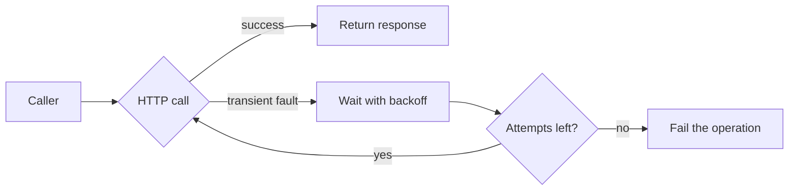

# HTTP Call Retries with Exponential Backoff

> **Transient Fault:** A failure that corrects itself after a short time, like a dropped connection, a timeout, or a 5xx from a service that is restarting.

-> Absorbing short-lived HTTP failures automatically instead of surfacing them to the caller.

---

## The Problem

Every outbound HTTP call can fail for reasons that have nothing to do with the request itself. The target service is redeploying. A container is being moved to another node. The connection pool handed out a socket that the other side already closed.

These faults share one property: the same request succeeds a moment later. Failing the whole operation because of them trades a few hundred milliseconds of patience for a user-visible error.

In this codebase the concrete exposure is the **KeyCloakClient**. User registration calls Keycloak over HTTP. If Keycloak restarts, registration fails, even though the request would succeed two seconds later.

---

## What the Pattern Does

A retry policy intercepts a failed HTTP call, waits, and sends it again, up to a fixed number of attempts. **Exponential backoff** grows the wait between attempts so a struggling service gets room to recover instead of a tight loop of repeats.



| Fault | Retry? |
|---|---|
| `HttpRequestException` (network level) | Yes |
| 5xx response | Yes |
| 408 Request Timeout | Yes |
| 404, 400, 409 and other 4xx | No, deterministic failures |

-> Retrying a 4xx hides bugs. The request is wrong, sending it again cannot fix it.

---

## Implementation with Polly and IHttpClientFactory

**Polly** is the standard .NET resilience library. It plugs into the `IHttpClientFactory` pipeline through the `Microsoft.Extensions.Http.Polly` package, so the retry logic lives in the client registration and the calling code never changes.

The policy is defined in a static method next to the client registration. `HandleTransientHttpError()` matches exactly the fault set in the table above.

`src/Modules/Users/Evently.Modules.Users.Infrastructure/UsersModule.cs`

```csharp
private static IAsyncPolicy<HttpResponseMessage> GetRetryPolicy()
{
    IEnumerable<TimeSpan> delay = Backoff.DecorrelatedJitterBackoffV2(
        medianFirstRetryDelay: TimeSpan.FromSeconds(1),
        retryCount: 5);

    return HttpPolicyExtensions
        .HandleTransientHttpError()
        .WaitAndRetryAsync(delay);
}
```

Attaching it to the typed client is one chained call:

`src/Modules/Users/Evently.Modules.Users.Infrastructure/UsersModule.cs`

```csharp
services
    .AddHttpClient<KeyCloakClient>((serviceProvider, httpClient) =>
    {
        KeyCloakOptions keycloakOptions = serviceProvider
            .GetRequiredService<IOptions<KeyCloakOptions>>().Value;

        httpClient.BaseAddress = new Uri(keycloakOptions.AdminUrl);
    })
    .AddHttpMessageHandler<KeyCloakAuthDelegatingHandler>()
    .AddPolicyHandler(GetRetryPolicy());
```

-> `AddPolicyHandler` goes after the delegating handlers. Each retry then re-enters `KeyCloakAuthDelegatingHandler` and gets a fresh token instead of replaying a possibly expired one.

---

## Why Jitter

Plain exponential backoff has a synchronization problem. When a service blips, every caller fails at the same instant and every caller retries at the same instant: 2 seconds later, then 4, then 8. The recovering service is hit by waves of simultaneous traffic exactly when it is weakest.

**Jitter** randomizes each caller's delay around the exponential curve. The retries spread into a smooth stream instead of spikes. `Backoff.DecorrelatedJitterBackoffV2` from `Polly.Contrib.WaitAndRetry` is the recommended generator: a controlled median first delay, exponential growth, decorrelated randomness.

| Strategy | Retry timing across many callers |
|---|---|
| Fixed delay | Synchronized waves, worst case |
| Exponential backoff | Synchronized waves, growing gaps |
| Exponential backoff with jitter | Evenly spread, no spikes |

---

## Caveats

A retried request executes more than once on the server. That is only safe when the operation is **idempotent**.

-> GET, PUT and DELETE are idempotent by contract. POST is not. Retry a POST only when the provider deduplicates or a duplicate is harmless.

Retries also have a ceiling. They cover faults that heal in seconds. When the dependency is down for minutes, five patient retries are just five slow failures, and thousands of callers doing that at once is a self-inflicted denial of service. That failure mode belongs to the **Circuit Breaker**, which pairs with this policy on the same client. See `http-circuit-breaker.md`.
