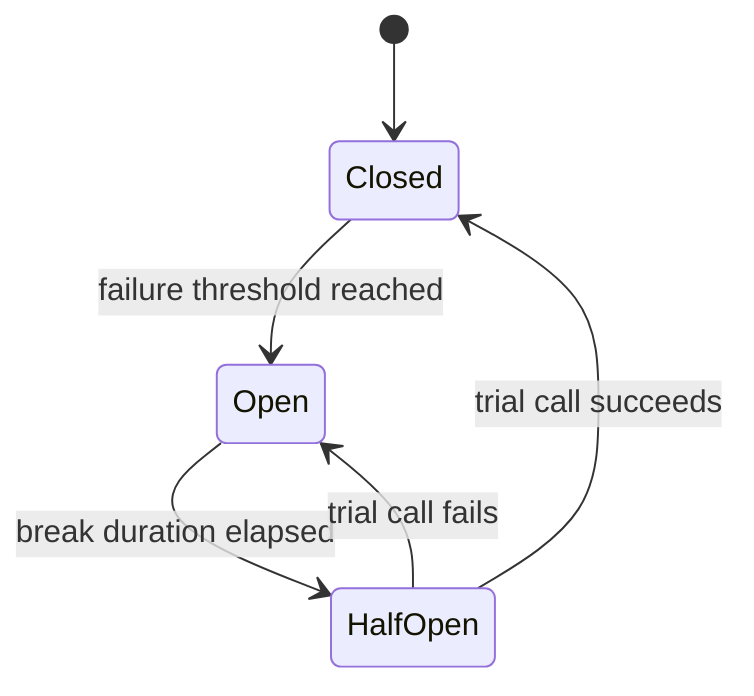

# Circuit Breaker for HTTP Calls

> **Circuit Breaker:** A policy that stops calling a dependency after repeated failures and fails fast until the dependency proves it recovered.

-> Preventing an application from hammering a dependency that is down and turning a partial outage into a full one.

---

## The Problem Retries Cannot Solve

The Retry pattern assumes the next attempt might succeed. That holds for faults that heal in seconds. It does not hold when the dependency is hard-down: a crashed service, a broken deployment, a datacenter issue.

Against a hard-down dependency, retries make things worse in two ways.

| Effect | Consequence |
|---|---|
| Every caller waits through full backoff | Latency piles up, threads and sockets stay occupied |
| Every caller keeps sending traffic | The failing service is hit hardest exactly when it is weakest |

-> Careless retries across many clients are a denial of service attack against your own infrastructure.

The circuit breaker is the defense barrier. Retry expects success. The breaker accepts failure, cuts the traffic off, and gives the dependency room to recover.

---

## The Three States



| State | Behavior |
|---|---|
| **Closed** | Calls flow normally, failures are counted |
| **Open** | Every call throws `BrokenCircuitException` instantly, no network traffic |
| **Half-Open** | One trial call is let through to probe recovery |

The fast failure in the Open state is the point. Callers get an immediate, cheap answer instead of a slow timeout, and the dependency receives zero load while it recovers.

---

## Implementation with Polly and IHttpClientFactory

The breaker uses the same `Microsoft.Extensions.Http.Polly` integration as the retry policy and attaches to the same typed client. The policy method:

`src/Modules/Users/Evently.Modules.Users.Infrastructure/UsersModule.cs`

```csharp
private static IAsyncPolicy<HttpResponseMessage> GetCircuitBreakerPolicy()
{
    return HttpPolicyExtensions
        .HandleTransientHttpError()
        .CircuitBreakerAsync(
            handledEventsAllowedBeforeBreaking: 5,
            durationOfBreak: TimeSpan.FromSeconds(30));
}
```

Five consecutive transient failures open the circuit for 30 seconds. The registration chains it after the retry policy on the **KeyCloakClient**:

`src/Modules/Users/Evently.Modules.Users.Infrastructure/UsersModule.cs`

```csharp
services
    .AddHttpClient<KeyCloakClient>((serviceProvider, httpClient) =>
    {
        KeyCloakOptions keycloakOptions = serviceProvider
            .GetRequiredService<IOptions<KeyCloakOptions>>().Value;

        httpClient.BaseAddress = new Uri(keycloakOptions.AdminUrl);
    })
    .AddHttpMessageHandler<KeyCloakAuthDelegatingHandler>()
    .AddPolicyHandler(GetRetryPolicy())
    .AddPolicyHandler(GetCircuitBreakerPolicy());
```

-> Registration order defines nesting. The retry policy wraps the breaker, so every individual attempt passes through it and feeds its failure counter. Once the circuit opens, remaining retries fail instantly on `BrokenCircuitException` instead of touching the network.

---

## Handling the Open Circuit in Callers

An open circuit surfaces as `BrokenCircuitException`. Left unhandled it becomes a generic 500. The caller should translate it into the codebase's `Result` type so the Presentation layer can return a meaningful 503:

`src/Modules/Users/Evently.Modules.Users.Infrastructure/Identity/IdentityProviderService.cs`

```csharp
try
{
    return await keyCloakClient.RegisterUserAsync(userRepresentation, cancellationToken);
}
catch (BrokenCircuitException)
{
    return Result.Failure<string>(IdentityProviderErrors.Unavailable);
}
```

The user sees "identity provider unavailable, try again shortly" instead of an unexplained failure, and the system keeps serving everything that does not depend on Keycloak.

---

## Choosing Retry, Breaker, or Both

| Pattern | Built for | Blind spot |
|---|---|---|
| Retry | Faults that heal in seconds | Keeps loading a hard-down dependency |
| Circuit Breaker | Outages lasting minutes | Does nothing for a single transient blip |
| Both, chained | The full failure spectrum | None, this is the default pairing |

-> Default to both on any typed client that crosses a process boundary. Retry handles the blips, the breaker handles the outages.

Polly also exposes `Isolate` and `Reset` on the breaker for manual control. A secured operations endpoint can trip the circuit on purpose, for example to take Keycloak offline for an upgrade without a wave of timeouts.
