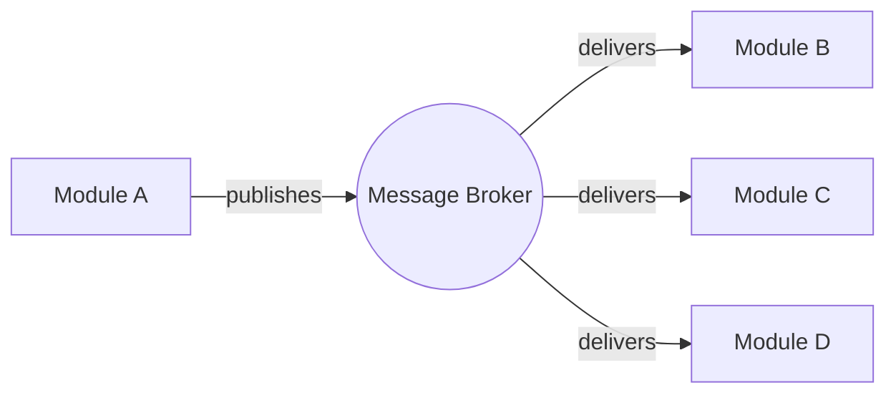

# Inbox Pattern: Idempotency

> **At Least Once Processing:** A guarantee that an Integration Event will be processed by a consumer *at least one time*, meaning that in the face of failures and retries, the same message may arrive more than once.

-> Avoiding duplicate side effects on the receiving end.

---

## Two Ways to Achieve Idempotency

1. Consumers are implemented as **idempotent** by design.
2. Implementing **explicit de-duplicating logic**.

---

## Message Flow



If **Module A** publishes the same message more than once (e.g., due to a retry after a failure), **Module B**, **C**, and **D** may each receive it multiple times.

What we really want is for each consumer module to process a given Integration Event **exactly once**, regardless of how many times the message arrives.

---

## How the Inbox Pattern Works

The inbox pattern is the consumer-side mirror of the Outbox Pattern. Instead of processing an Integration Event the moment it arrives from the bus, the consumer **persists the raw message** into an `inbox_messages` table first, and then a background job picks it up and processes it in a controlled, de-duplicated way.

This gives us two layers of protection:

| Layer | Responsibility |
|---|---|
| `IntegrationEventConsumer` | Receives from the bus and writes to `inbox_messages` |
| `ProcessInboxJob` | Reads unprocessed messages and dispatches to handlers |
| `IdempotentIntegrationEventHandler` | Guards each handler against running twice for the same event |

---

## Where is this implemented in code?

### 1. The Inbox Message

`src/Common/Evently.Common.Infrastructure/Inbox/InboxMessage.cs`

```csharp
public sealed class InboxMessage
{
    public Guid Id { get; init; }
    public string Type { get; init; }
    public string Content { get; init; }
    public DateTime OccurredOnUtc { get; init; }
    public DateTime? ProcessedOnUtc { get; init; }
    public string? Error { get; init; }
}
```

`ProcessedOnUtc` is `null` until the background job successfully dispatches the message. `Error` captures any exception so failed messages are visible without being silently dropped.

---

### 2. Receiving from the Bus: `IntegrationEventConsumer`

`src/Modules/Users/Evently.Modules.Users.Infrastructure/Inbox/IntegrationEventConsumer.cs`

```csharp
internal sealed class IntegrationEventConsumer<TIntegrationEvent>(IDbConnectionFactory dbConnectionFactory)
    : IConsumer<TIntegrationEvent>
    where TIntegrationEvent : IntegrationEvent
{
    public async Task Consume(ConsumeContext<TIntegrationEvent> context)
    {
        await using DbConnection connection = await dbConnectionFactory.OpenConnectionAsync();

        TIntegrationEvent integrationEvent = context.Message;

        var inboxMessage = new InboxMessage
        {
            Id = integrationEvent.Id,
            Type = integrationEvent.GetType().Name,
            Content = JsonConvert.SerializeObject(integrationEvent, SerializerSettings.Instance),
            OccurredOnUtc = integrationEvent.OccurredOnUtc
        };

        const string sql =
            """
            INSERT INTO users.inbox_messages(id, type, content, occurred_on_utc)
            VALUES (@Id, @Type, @Content::json, @OccurredOnUtc)
            """;

        await connection.ExecuteAsync(sql, inboxMessage);
    }
}
```

The MassTransit consumer does **no business logic at all**; it only persists the incoming event. The bus can retry the delivery; the database `Id` primary key prevents the same message from being inserted twice.

---

### 3. Processing: `ProcessInboxJob`

`src/Modules/Users/Evently.Modules.Users.Infrastructure/Inbox/ProcessInboxJob.cs`

```csharp
[DisallowConcurrentExecution]
internal sealed class ProcessInboxJob(...) : IJob
{
    public async Task Execute(IJobExecutionContext context)
    {
        // 1. Fetch a batch of unprocessed inbox messages (FOR UPDATE lock)
        IReadOnlyList<InboxMessageResponse> inboxMessages = await GetInboxMessagesAsync(...);

        foreach (InboxMessageResponse inboxMessage in inboxMessages)
        {
            // 2. Deserialize the stored JSON back into an IIntegrationEvent
            IIntegrationEvent integrationEvent = JsonConvert.DeserializeObject<IIntegrationEvent>(...);

            // 3. Resolve all handlers for this event type from the DI container
            IEnumerable<IIntegrationEventHandler> handlers = IntegrationEventHandlersFactory.GetHandlers(...);

            // 4. Dispatch to each handler (wrapped by IdempotentIntegrationEventHandler)
            foreach (IIntegrationEventHandler handler in handlers)
            {
                await handler.Handle(integrationEvent, context.CancellationToken);
            }

            // 5. Mark the message as processed (or record the error)
            await UpdateInboxMessageAsync(...);
        }
    }
}
```

`[DisallowConcurrentExecution]` ensures that only one instance of the job runs at a time per module, preventing a second job instance from picking up messages that are already in flight.

---

### 4. De-duplication: `IdempotentIntegrationEventHandler`

`src/Modules/Users/Evently.Modules.Users.Infrastructure/Inbox/IdempotentIntegrationEventHandler.cs`

```csharp
internal sealed class IdempotentIntegrationEventHandler<TIntegrationEvent>(
    IIntegrationEventHandler<TIntegrationEvent> decorated,
    IDbConnectionFactory dbConnectionFactory)
    : IntegrationEventHandler<TIntegrationEvent>
    where TIntegrationEvent : IIntegrationEvent
{
    public override async Task Handle(
        TIntegrationEvent integrationEvent,
        CancellationToken cancellationToken = default)
    {
        await using DbConnection connection = await dbConnectionFactory.OpenConnectionAsync();

        var inboxMessageConsumer = new InboxMessageConsumer(integrationEvent.Id, decorated.GetType().Name);

        // Skip if this handler already ran for this message
        if (await InboxConsumerExistsAsync(connection, inboxMessageConsumer))
        {
            return;
        }

        await decorated.Handle(integrationEvent, cancellationToken);

        // Record that this handler has now completed
        await InsertInboxConsumerAsync(connection, inboxMessageConsumer);
    }
}
```

This is the **Decorator Pattern** applied to `IIntegrationEventHandler`. It wraps the real handler and checks `inbox_message_consumers` before letting the inner logic run. The composite key `(InboxMessageId, HandlerName)` means each handler is tracked independently: if Handler A fails but Handler B succeeds, only Handler A is retried.

---

### 5. The `InboxMessageConsumer` Record

`src/Common/Evently.Common.Infrastructure/Inbox/InboxMessageConsumer.cs`

```csharp
public sealed class InboxMessageConsumer(Guid inboxMessageId, string name)
{
    public Guid InboxMessageId { get; init; } = inboxMessageId;
    public string Name { get; init; } = name;
}
```

The composite primary key `(InboxMessageId, Name)` is the idempotency token. Once a row exists, the corresponding handler will never execute again for that message.

---

## Inbox vs. Outbox: Side by Side

| Concern | Outbox Pattern | Inbox Pattern |
|---|---|---|
| Protects | **Publisher** side | **Consumer** side |
| Targets | Domain Events → Integration Events | Integration Events → Handlers |
| "At Least Once" guarantee | Delivery to the bus | Processing by each handler |
| Storage table | `outbox_messages` | `inbox_messages` |
| De-duplication table | `outbox_message_consumers` | `inbox_message_consumers` |
| Background job | `ProcessOutboxJob` | `ProcessInboxJob` |
| Idempotency wrapper | `IdempotentDomainEventHandler` | `IdempotentIntegrationEventHandler` |
