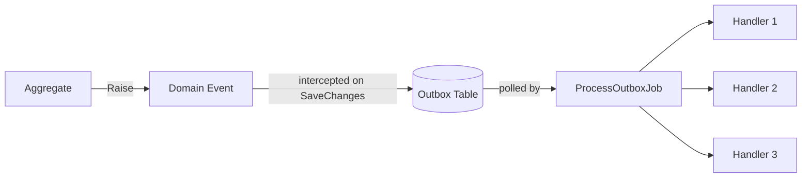

# Outbox Pattern: Domain Events

> **At Least Once Delivery:** A guarantee that a Domain Event will be delivered to its handlers *at least one time*, meaning that even if processing fails mid-way, the event will be retried until it succeeds.

-> Avoiding silent event loss when publishing Domain Events.

---

## The Problem

Without the outbox pattern, Domain Events are raised in memory and dispatched directly after `SaveChanges`. This creates a hidden race condition:

```
1. Business state is saved to the database  ✓
2. Domain Event is published to handlers    ✗  (crash, timeout, network blip)
```

The state changed, but the event was never delivered. The system is now **inconsistent** with no record of what was missed.

---

## Message Flow



The Domain Event is **never dispatched directly**. Instead, it is persisted into the `outbox_messages` table inside the **same database transaction** as the aggregate state change. A background job then picks it up and dispatches it to the handlers in a separate step.

This atomicity is the core guarantee: you either get both the state change and the event record, or neither.

---

## How the Outbox Pattern Works

| Layer | Responsibility |
|---|---|
| `Entity.Raise()` | Collects domain events in memory on the aggregate |
| `InsertOutboxMessagesInterceptor` | Serialises events to `outbox_messages` atomically on `SaveChanges` |
| `ProcessOutboxJob` | Background job that reads unprocessed messages and dispatches to handlers |
| `IdempotentDomainEventHandler` | Guards each handler against running twice for the same event |

---

## Where is this implemented in code?

### 1. Raising Domain Events: `Entity`

`src/Common/Evently.Common.Domain/Entity.cs`

```csharp
public abstract class Entity
{
    private readonly List<IDomainEvent> _domainEvents = [];

    public IReadOnlyCollection<IDomainEvent> DomainEvents => _domainEvents.ToList();

    public void ClearDomainEvents() => _domainEvents.Clear();

    protected void Raise(IDomainEvent domainEvent)
    {
        _domainEvents.Add(domainEvent);
    }
}
```

Aggregates call `Raise(new SomeDomainEvent(...))` inside their domain logic. Events live in memory until `SaveChanges` is called; that is when the interceptor picks them up.

---

### 2. Persisting Atomically: `InsertOutboxMessagesInterceptor`

`src/Common/Evently.Common.Infrastructure/Outbox/InsertOutboxMessagesInterceptor.cs`

```csharp
public sealed class InsertOutboxMessagesInterceptor : SaveChangesInterceptor
{
    public override async ValueTask<InterceptionResult<int>> SavingChangesAsync(
        DbContextEventData eventData,
        InterceptionResult<int> result,
        CancellationToken cancellationToken = default)
    {
        if (eventData.Context is not null)
        {
            InsertOutboxMessages(eventData.Context);
        }

        return await base.SavingChangesAsync(eventData, result, cancellationToken);
    }

    private static void InsertOutboxMessages(DbContext context)
    {
        var outboxMessages = context.ChangeTracker
            .Entries<Entity>()
            .SelectMany(entry =>
            {
                IReadOnlyCollection<IDomainEvent> events = entry.Entity.DomainEvents;
                entry.Entity.ClearDomainEvents();
                return events;
            })
            .Select(domainEvent => new OutboxMessage
            {
                Id = domainEvent.Id,
                Type = domainEvent.GetType().Name,
                Content = JsonConvert.SerializeObject(domainEvent, SerializerSettings.Instance),
                OccurredOnUtc = domainEvent.OccurredOnUtc
            })
            .ToList();

        context.Set<OutboxMessage>().AddRange(outboxMessages);
    }
}
```

This EF Core interceptor hooks into `SavingChangesAsync`, **before** the `INSERT`/`UPDATE` for the aggregate hits the database. It walks the change tracker, drains the in-memory domain events from every tracked `Entity`, serialises them as `OutboxMessage` rows, and adds them to the same `DbContext`. Everything then commits in one atomic transaction.

---

### 3. The Outbox Message

`src/Common/Evently.Common.Infrastructure/Outbox/OutboxMessage.cs`

```csharp
public sealed class OutboxMessage
{
    public Guid Id { get; init; }
    public string Type { get; init; }
    public string Content { get; init; }
    public DateTime OccurredOnUtc { get; init; }
    public DateTime? ProcessedOnUtc { get; init; }
    public string? Error { get; init; }
}
```

`ProcessedOnUtc` is `null` until the background job successfully dispatches the message. `Error` captures any exception so failed messages are visible and retryable without being silently dropped.

---

### 4. Dispatching: `ProcessOutboxJob`

`src/Modules/Events/Evently.Modules.Events.Infrastructure/Outbox/ProcessOutboxJob.cs`

```csharp
[DisallowConcurrentExecution]
internal sealed class ProcessOutboxJob(...) : IJob
{
    public async Task Execute(IJobExecutionContext context)
    {
        // 1. Fetch a batch of unprocessed outbox messages (FOR UPDATE lock)
        IReadOnlyList<OutboxMessageResponse> outboxMessages = await GetOutboxMessagesAsync(...);

        foreach (OutboxMessageResponse outboxMessage in outboxMessages)
        {
            // 2. Deserialize the stored JSON back into an IDomainEvent
            IDomainEvent domainEvent = JsonConvert.DeserializeObject<IDomainEvent>(...);

            // 3. Resolve all handlers for this event type from the DI container
            IEnumerable<IDomainEventHandler> handlers = DomainEventHandlersFactory.GetHandlers(
                domainEvent.GetType(),
                scope.ServiceProvider,
                Application.AssemblyReference.Assembly);

            // 4. Dispatch to each handler (wrapped by IdempotentDomainEventHandler)
            foreach (IDomainEventHandler handler in handlers)
            {
                await handler.Handle(domainEvent);
            }

            // 5. Mark the message as processed (or record the error)
            await UpdateOutboxMessageAsync(...);
        }
    }
}
```

`[DisallowConcurrentExecution]` ensures only one job instance runs per module at a time. The `FOR UPDATE` lock in the SQL query prevents two concurrent instances from picking up the same messages. The job queries only rows where `processed_on_utc IS NULL`, ordered by `occurred_on_utc` to preserve chronological dispatch order.

---

### 5. De-duplication: `IdempotentDomainEventHandler`

`src/Modules/Events/Evently.Modules.Events.Infrastructure/Outbox/IdempotentDomainEventHandler.cs`

```csharp
internal sealed class IdempotentDomainEventHandler<TDomainEvent>(
    IDomainEventHandler<TDomainEvent> decorated,
    IDbConnectionFactory dbConnectionFactory)
    : DomainEventHandler<TDomainEvent>
    where TDomainEvent : IDomainEvent
{
    public override async Task Handle(TDomainEvent domainEvent, CancellationToken cancellationToken = default)
    {
        await using DbConnection connection = await dbConnectionFactory.OpenConnectionAsync();

        var outboxMessageConsumer = new OutboxMessageConsumer(domainEvent.Id, decorated.GetType().Name);

        // Skip if this handler already ran for this event
        if (await OutboxConsumerExistsAsync(connection, outboxMessageConsumer))
        {
            return;
        }

        await decorated.Handle(domainEvent, cancellationToken);

        // Record that this handler has now completed
        await InsertOutboxConsumerAsync(connection, outboxMessageConsumer);
    }
}
```

This is the **Decorator Pattern** applied to `IDomainEventHandler`. Before delegating to the real handler, it checks `outbox_message_consumers`. The composite key `(OutboxMessageId, HandlerName)` means each handler is tracked independently: if Handler A fails but Handler B succeeds, only Handler A is retried on the next job run.

---

### 6. The `OutboxMessageConsumer` Record

`src/Common/Evently.Common.Infrastructure/Outbox/OutboxMessageConsumer.cs`

```csharp
public sealed class OutboxMessageConsumer(Guid outboxMessageId, string name)
{
    public Guid OutboxMessageId { get; init; } = outboxMessageId;
    public string Name { get; init; } = name;
}
```

The composite primary key `(OutboxMessageId, Name)` is the idempotency token. Once a row exists for a given `(eventId, handlerName)` pair, that handler will never execute again for that event, regardless of how many times the job retries the message.

---

## Outbox vs. Inbox: Side by Side

| Concern | Outbox Pattern | Inbox Pattern |
|---|---|---|
| Protects | **Publisher** side | **Consumer** side |
| Targets | Domain Events → Handlers | Integration Events → Handlers |
| "At Least Once" guarantee | Delivery from aggregate to handlers | Processing by each consumer module |
| Atomicity anchor | Same DB transaction as the aggregate write | DB `INSERT` on message receipt from bus |
| Storage table | `outbox_messages` | `inbox_messages` |
| De-duplication table | `outbox_message_consumers` | `inbox_message_consumers` |
| Background job | `ProcessOutboxJob` | `ProcessInboxJob` |
| Idempotency wrapper | `IdempotentDomainEventHandler` | `IdempotentIntegrationEventHandler` |

See also: [[inbox-pattern-concept]]
