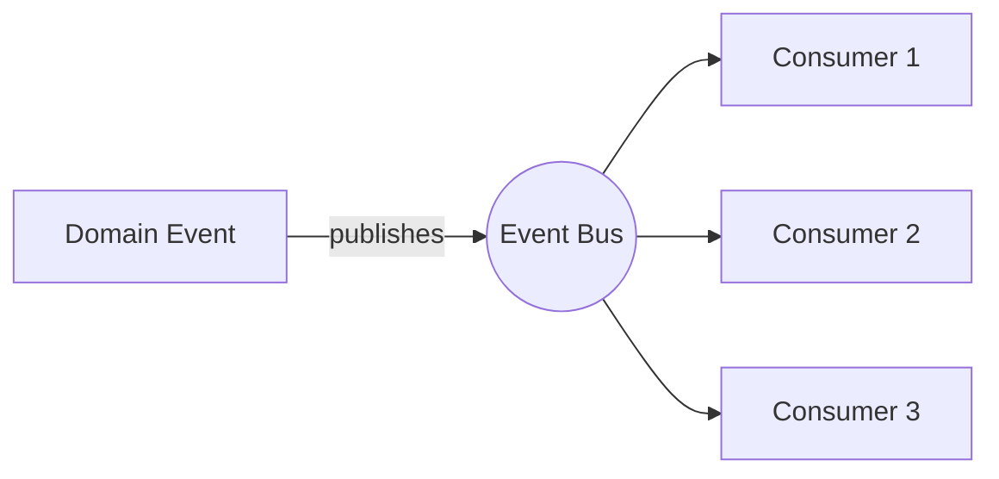

# Outbox Pattern — Idempotency

> **Idempotency:** The ability of a system to produce the same outcome, even if the same event or message is received more than once.

-> Avoiding duplicate behaviour.

---

## Two Ways to Achieve Idempotency

1. Consumers are implemented as **idempotent** by design.
2. Implementing **explicit de-duplicating logic**.

---

## Message Flow



If **Consumer 3** presents an error, we would have to retry the publish. This could run some of the consumers more than once.

What we really want is to only execute the event handlers that **did not execute before**.

---

## Where is this implemented in code?

The entry point for event handling is the `Handle` method on `IDomainEventHandler`:

`src/Common/Evently.Common.Application/Messaging/IDomainEventHandler.cs`

```csharp
public interface IDomainEventHandler<in TDomainEvent> : IDomainEventHandler
    where TDomainEvent : IDomainEvent
{
    Task Handle(TDomainEvent domainEvent, CancellationToken cancellationToken = default);
}

public interface IDomainEventHandler
{
    Task Handle(IDomainEvent domainEvent, CancellationToken cancellationToken = default);
}
```

Each consumer implements `IDomainEventHandler<TDomainEvent>` and provides its own `Handle` implementation. The idempotency logic wraps these handlers to ensure they are only executed once per event, even if the message is delivered multiple times.
