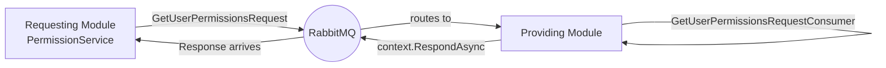

# Request-Response Messaging with IRequestClient

> **IRequestClient<T>:** A MassTransit abstraction that sends a typed message over the bus and blocks the caller until a typed response arrives.

-> Querying data across module boundaries when there is no shared database table or acceptable projection.

---

## When to Use This Pattern

Each module owns its data. No module reads another module's database directly.

When one module needs data owned by another and that data is not replicated into a shared table, the options narrow down:

| Option | When it fits |
|---|---|
| Shared projection / read model | Data changes rarely and the consumer can own a denormalized copy |
| HTTP call | Services communicate over the network in a true microservice topology |
| **IRequestClient<T>** | The module boundary is enforced through the bus and no acceptable replicated table exists |

-> Prefer a projection when the data is stable and high-read-volume. Use IRequestClient when the data is volatile or strict ownership in the provider is required.

---

## The Contract

The **request record** lives in the provider module's `IntegrationEvents` project. Both the provider and the consumer reference this project. The response type is any type already shared between modules.

`src/Modules/Users/Evently.Modules.Users.IntegrationEvents/GetUserPermissionsRequest.cs`

```csharp
public sealed record GetUserPermissionsRequest(string IdentityId);
```

There is no Integration Event here. The record is the message contract. The response type (`PermissionsResponse`) is defined in `Evently.Common.Application` and is already shared.

---

## Message Flow



The caller awaits `GetResponse<TResponse, TError>()`. MassTransit manages the temporary reply queue and the correlation id. The request and response are two separate messages on the bus.

---

## Provider Side: The Consumer

The Users module defines the **consumer** in its `Presentation` layer. It receives the request, queries its own data through `IPermissionService`, and responds via `context.RespondAsync`.

`src/Modules/Users/Evently.Modules.Users.Presentation/Users/GetUserPermissionsRequestConsumer.cs`

```csharp
public sealed class GetUserPermissionsRequestConsumer(IPermissionService permissionService)
    : IConsumer<GetUserPermissionsRequest>
{
    public async Task Consume(ConsumeContext<GetUserPermissionsRequest> context)
    {
        Result<PermissionsResponse> result =
            await permissionService.GetUserPermissionsAsync(context.Message.IdentityId);

        if (result.IsSuccess)
        {
            await context.RespondAsync(result.Value);
        }
        else
        {
            await context.RespondAsync(result.Error);
        }
    }
}
```

-> This consumer does NOT go through the inbox. It is registered directly and responds inline. The **inbox pattern** handles fire-and-forget integration events, not request-response.

Both the success and failure paths call `RespondAsync` with typed values. The caller uses `response.Is(out Response<T>)` to discriminate between them.

The provider's own `PermissionService` queries its local database through MediatR:

`src/Modules/Users/Evently.Modules.Users.Infrastructure/Authorization/PermissionService.cs`

```csharp
internal sealed class PermissionService(ISender sender) : IPermissionService
{
    public async Task<Result<PermissionsResponse>> GetUserPermissionsAsync(string identityId)
    {
        return await sender.Send(new GetUserPermissionsQuery(identityId));
    }
}
```

---

## Consumer Side: Sending the Request

The Ticketing module injects `IRequestClient<GetUserPermissionsRequest>` and calls `GetResponse` with all expected response types. MassTransit resolves the client automatically once the consumer is registered on the provider side.

`src/Modules/Ticketing/Evently.Modules.Ticketing.Infrastructure/Authorization/PermissionService.cs`

```csharp
internal sealed class PermissionService(
    IRequestClient<GetUserPermissionsRequest> requestClient,
    ICacheService cacheService) : IPermissionService
{
    private static readonly Error NotFound = Error.NotFound(nameof(PermissionService), "The user was not found");
    private static readonly TimeSpan CacheExpiration = TimeSpan.FromMinutes(5);

    public async Task<Result<PermissionsResponse>> GetUserPermissionsAsync(string identityId)
    {
        PermissionsResponse? permissionsResponse =
            await cacheService.GetAsync<PermissionsResponse>(CreateCacheKey(identityId));

        if (permissionsResponse is not null)
        {
            return permissionsResponse;
        }

        var request = new GetUserPermissionsRequest(identityId);

        Response<PermissionsResponse, Error> response =
            await requestClient.GetResponse<PermissionsResponse, Error>(request);

        if (response.Is(out Response<Error> errorResponse))
        {
            return Result.Failure<PermissionsResponse>(errorResponse.Message);
        }

        if (response.Is(out Response<PermissionsResponse> permissionResponse))
        {
            await cacheService.SetAsync(
                CreateCacheKey(identityId),
                permissionResponse.Message,
                CacheExpiration);

            return permissionResponse.Message;
        }

        return Result.Failure<PermissionsResponse>(NotFound);
    }

    private static string CreateCacheKey(string identityId) => $"user-permissions:{identityId}";
}
```

---

## Registration

The consumer is registered in the provider module's `ConfigureConsumers` method. The `instanceId` suffix makes the queue name unique per service instance, consistent with how all other consumers are registered.

`src/Modules/Users/Evently.Modules.Users.Infrastructure/UsersModule.cs`

```csharp
public static void ConfigureConsumers(IRegistrationConfigurator registrationConfigurator, string instanceId)
{
    registrationConfigurator.AddConsumer<GetUserPermissionsRequestConsumer>()
        .Endpoint(c => c.InstanceId = instanceId);
}
```

The method group is passed directly to `AddInfrastructure` in `Program.cs` alongside the other module consumer configurations.

`src/API/Evently.Api/Program.cs`

```csharp
builder.Services.AddInfrastructure(
    DiagnosticsConfig.ServiceName,
    [
        EventsModule.ConfigureConsumers(redisConnectionString),
        AttendanceModule.ConfigureConsumers,
        UsersModule.ConfigureConsumers
    ],
    rabbitMqSettings,
    databaseConnectionString,
    redisConnectionString);
```

No additional registration is needed on the consumer side. MassTransit injects `IRequestClient<T>` automatically.

---

## Caching Responses

Cross-module requests over the bus add latency on every call. Permission checks run on every authenticated request, so every cache miss translates to a round-trip through RabbitMQ.

The Ticketing `PermissionService` caches responses in Redis via `ICacheService` with a 5-minute TTL. The bus is only hit on a cache miss.

| Question | Decision |
|---|---|
| Is this data read frequently per request? | Cache it |
| Does the data change rarely (like permissions)? | Cache it with a TTL |
| Does staleness cause a security or correctness issue? | Lower the TTL or invalidate on change |
| Is the response expensive to compute on the provider? | Cache it |

-> Always analyze the caching opportunity before wiring IRequestClient. If the data changes frequently and staleness is unacceptable, reconsider whether a projection or direct ownership of the data is the right model.
