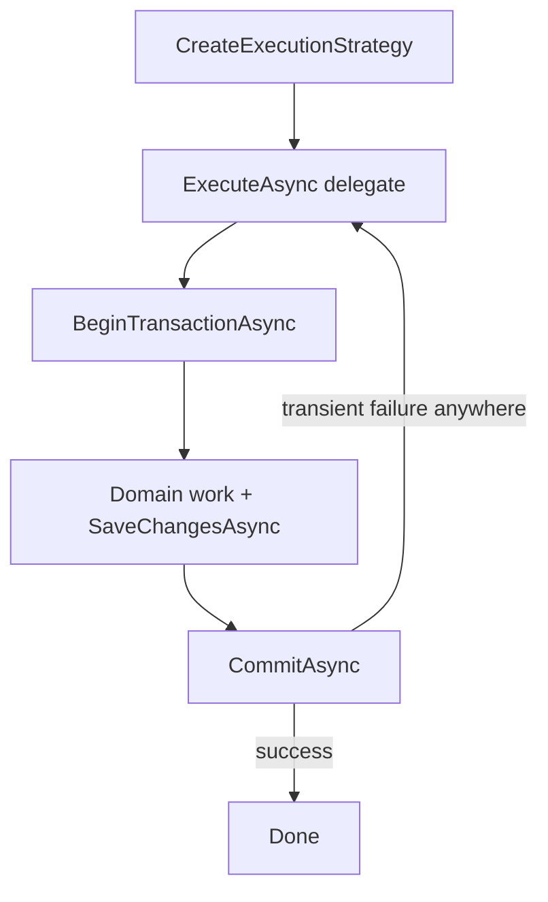

# Resilient EF Core Connections

> **Execution Strategy:** An EF Core component that wraps every database operation and re-runs it when a transient failure occurs.

-> Surviving dropped connections and short database outages without failing the request.

---

## The Problem

Database calls fail for reasons unrelated to the query. The connection pool returns a connection that Postgres already closed. The database container restarts. A failover swaps the primary. The query is fine, the moment is not.

By default EF Core surfaces these as exceptions and the command handler fails. In a modular monolith one flaky connection can fail a request that touched three modules.

EF Core ships a retrying execution strategy for exactly this. It is off by default and enabled per DbContext. Each module in this codebase owns its DbContext, so each module opts in at its own registration.

---

## Enabling Retry on Failure

One call inside the `UseNpgsql` options action swaps the default strategy for `NpgsqlRetryingExecutionStrategy`. Every query and every `SaveChangesAsync` becomes its own retryable unit.

`src/Modules/Users/Evently.Modules.Users.Infrastructure/UsersModule.cs`

```csharp
services.AddDbContext<UsersDbContext>((sp, options) =>
    options
        .UseNpgsql(
            configuration.GetConnectionString("Database"),
            npgsqlOptions => npgsqlOptions
                .MigrationsHistoryTable(HistoryRepository.DefaultTableName, Schemas.Users)
                .EnableRetryOnFailure(
                    maxRetryCount: 5,
                    maxRetryDelay: TimeSpan.FromSeconds(10),
                    errorCodesToAdd: null))
        .AddInterceptors(sp.GetRequiredService<InsertOutboxMessagesInterceptor>())
        .UseSnakeCaseNamingConvention());
```

The same change applies to the Events, Ticketing and Attendance registrations. The strategy classifies known transient Postgres error codes and retries only those, with exponential backoff between attempts.

| Parameter | Meaning |
|---|---|
| `maxRetryCount` | Attempts before the original exception is rethrown |
| `maxRetryDelay` | Cap on the backoff delay between attempts |
| `errorCodesToAdd` | Extra Postgres error codes to treat as transient |

---

## The User-Initiated Transaction Trap

With retries enabled, EF Core must be able to re-run any failed unit from the start. A transaction opened manually with `BeginTransaction` breaks that assumption: EF cannot know what else belongs to the unit. It refuses loudly:

`System.InvalidOperationException`

```
The configured execution strategy 'NpgsqlRetryingExecutionStrategy' does not
support user initiated transactions. Use the execution strategy returned by
'DbContext.Database.CreateExecutionStrategy()' to execute all the operations
in the transaction as a retriable unit.
```

This codebase has exactly that shape in the Ticketing module. Command handlers open explicit transactions through the unit of work:

`src/Modules/Ticketing/Evently.Modules.Ticketing.Application/Payments/RefundPaymentsForEvent/RefundPaymentsForEventCommandHandler.cs`

```csharp
await using DbTransaction transaction = await unitOfWork.BeginTransactionAsync(cancellationToken);
```

-> Enabling `EnableRetryOnFailure` on `TicketingDbContext` without touching these handlers turns every one of them into a runtime exception.

---

## The Fix: Wrap the Whole Unit in the Strategy

The strategy exposes `ExecuteAsync`, which takes a delegate covering everything that belongs to the transaction. On a transient failure the whole delegate runs again, transaction included.



`src/Modules/Ticketing/Evently.Modules.Ticketing.Application/Payments/RefundPaymentsForEvent/RefundPaymentsForEventCommandHandler.cs`

```csharp
IExecutionStrategy strategy = dbContext.Database.CreateExecutionStrategy();

await strategy.ExecuteAsync(async () =>
{
    await using DbTransaction transaction = await unitOfWork.BeginTransactionAsync(cancellationToken);

    // domain work and SaveChangesAsync calls

    await transaction.CommitAsync(cancellationToken);
});
```

When the pattern repeats, a small `ResilientTransaction` helper in `Evently.Common.Infrastructure` can own the create-strategy, begin, execute, commit sequence and every handler passes only the delegate.

---

## What the Strategy Does Not Cover

The retrying strategy lives inside EF Core. Anything bypassing EF is out of scope.

-> The Outbox and Inbox background jobs (`ProcessOutboxJob`, `ProcessInboxJob`) open transactions on a raw `DbConnection` and query with Dapper. The EF execution strategy never sees them. Their resilience comes from Quartz re-running the job on the next tick.

The retried delegate can also execute more than once. Side effects that are not part of the database transaction, like publishing to the bus or calling HTTP services, do not belong inside it. The outbox pattern already enforces this split: domain events are written in the same transaction and published later by the job.
