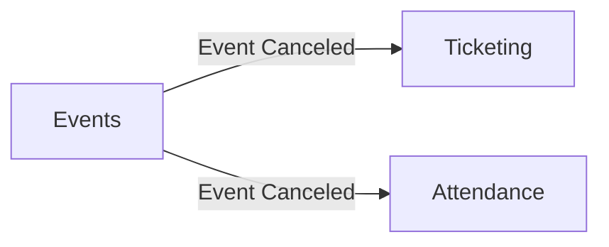
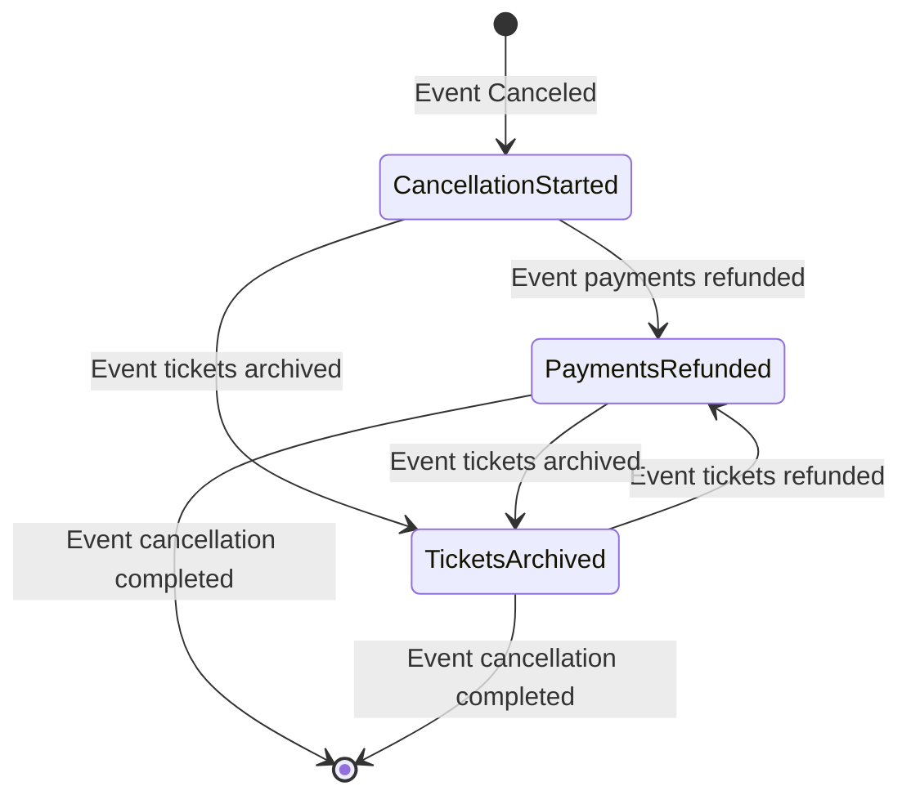

# Saga Pattern — Orchestration

> **Complex Business Flows:** A pattern for managing a sequence of steps that must happen in order across multiple modules — with a clear owner responsible for coordinating each step and handling failures.

-> Turning a tangled web of cross-module events into a controlled, trackable workflow.

---

## The Problem

**Example: Event Cancellation Flow**

When an event is canceled, two things need to happen:

- **Ticketing** must refund all already-paid orders and cancel any issued tickets.
- **Attendance** must archive any existing tickets.

Handling a complex flow like this in EDA is complicated — we would have to treat multiple error flows in case of anything going wrong.

-> A flow of individual steps that must happen one after another.

The **Saga Pattern** can help us manage this heavily business-loaded flow.

---

## What is a Saga?

A Saga is a sequence of local transactions, each of which publishes an event or sends a message that triggers the next step. If a step fails, the saga executes compensating transactions to undo the work already done.

There are two styles of Saga coordination:

| Style | Description |
|---|---|
| **Choreography** | Each service reacts to events and decides its own next step — no central coordinator |
| **Orchestration** | A central Saga Orchestrator drives the flow, telling each service what to do and when |

This codebase uses the **Orchestration** style.

---

## State Machine

The Event Cancellation saga can be modelled as a state machine:

Each arrow is an event triggering a state transition. The saga keeps track of which state it is in, so it always knows what has been done and what still needs to happen — even across failures and restarts.

---

## Why Orchestration?

With choreography, each module only knows about its own step. If the flow breaks halfway through, there is no single place to look at to understand what happened or to trigger a retry. The state of the overall workflow is implicit — spread across multiple services.

With an orchestrator:

- The **current state** is explicit and persisted.
- **Failures** are caught in one place and handled with compensating transactions.
- **Progress** is observable — you can query the saga to see exactly where a cancellation is.

---

*(...to be continued)*
