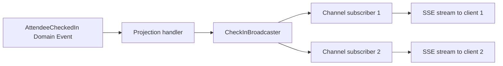

# Server-Sent Events

> **Server-Sent Events:** A one way channel where the server pushes a stream of events to a client over a single long lived HTTP response.

-> Delivering live updates to clients without polling waste and without the weight of WebSockets.

---

## Where SSE Fits

| Approach | Direction | Transport | Best for |
|---|---|---|---|
| Polling | Client pulls | Repeated HTTP requests | Nothing, it wastes requests between changes |
| SSE | Server pushes | One long lived HTTP response | Dashboards, notifications, progress, token streams |
| WebSockets | Both ways | Dedicated socket protocol | Games, chat, high frequency client messages |
| SignalR | Both ways | WebSockets with fallbacks | RPC style calls, many client SDKs |

SSE runs over plain HTTP, so it passes through existing auth, load balancers, and HTTP/2 multiplexing. Browsers consume it with the built in **EventSource** API and reconnect automatically after a drop. When the client only listens, SSE is the simplest tool that works.

-> Evently runs .NET 8 today. Native SSE support ships in .NET 10, so this doc describes the target shape for the framework upgrade.

---

## The Wire Format

The response has content type `text/event-stream` and streams plain text records. Each record is a set of `field: value` lines terminated by a blank line:

```
event: check-in
id: 42
data: {"attendeeId":"8f2f...","eventId":"a1b4..."}

```

-> The blank line is the record terminator. Without the double newline the browser holds the event and nothing fires on the client.

---

## Native Support in .NET 10

.NET 10 adds the `System.Net.ServerSentEvents` namespace and `TypedResults.ServerSentEvents`, which turns any `IAsyncEnumerable` into a spec compliant stream. The framework sets the content type, keeps the connection alive, and formats every record. What used to take 200 lines of manual header and flush management becomes one endpoint:

`src/Modules/Attendance/Evently.Modules.Attendance.Presentation/Attendees/StreamCheckIns.cs`

```csharp
app.MapGet("events/{eventId}/check-ins/stream",
    (Guid eventId, CheckInBroadcaster broadcaster, CancellationToken cancellationToken) =>
        TypedResults.ServerSentEvents(broadcaster.Subscribe(eventId, cancellationToken)));
```

Each element is an **SseItem**:

| Property | Required | Purpose |
|---|---|---|
| `Data` | Yes | The payload, serialized to the `data:` field |
| `EventType` | No | Named event the client subscribes to |
| `EventId` | No | Position marker used for reconnection |
| `ReconnectionInterval` | No | Client retry delay after a drop |

---

## Producing the Stream

The producer is an async iterator. Cancellation wiring is not optional:

`src/Modules/Attendance/Evently.Modules.Attendance.Presentation/Attendees/CheckInBroadcaster.cs`

```csharp
public async IAsyncEnumerable<SseItem<CheckInResponse>> Subscribe(
    Guid eventId,
    [EnumeratorCancellation] CancellationToken cancellationToken)
{
    var channel = Channel.CreateUnbounded<CheckInResponse>();
    AddSubscriber(eventId, channel);

    try
    {
        await foreach (CheckInResponse checkIn in channel.Reader.ReadAllAsync(cancellationToken))
        {
            yield return new SseItem<CheckInResponse>(checkIn)
            {
                EventType = "check-in",
                EventId = checkIn.Sequence.ToString()
            };
        }
    }
    finally
    {
        RemoveSubscriber(eventId, channel);
    }
}
```

-> Without `[EnumeratorCancellation]` the iterator keeps running after the client disconnects and the connection's resources leak.

Fan out uses **System.Threading.Channels**, one channel per subscriber and one shared upstream source. The broadcast side writes each new item to every subscriber channel. In Evently the natural producer is a Domain Event handler, the same place a projection updates its read table can push the fresh value to the broadcaster.



---

## Reconnection With Last-Event-ID

When the connection drops, the browser reconnects on its own and sends the last `EventId` it received in the **Last-Event-ID** header. The framework does not replay anything for you. Read the header and resume:

`src/Modules/Attendance/Evently.Modules.Attendance.Presentation/Attendees/StreamCheckIns.cs`

```csharp
app.MapGet("events/{eventId}/check-ins/stream", (Guid eventId, HttpContext context) =>
{
    string? lastEventId = context.Request.Headers["Last-Event-ID"].FirstOrDefault();

    return TypedResults.ServerSentEvents(StreamFrom(eventId, lastEventId));
});
```

A bounded replay buffer keyed by sequence number lets a reconnecting client catch up on what it missed before joining the live stream. Clients that never disconnect never touch the buffer.

---

## Consuming the Stream

Browsers use `EventSource`, which needs three lines and reconnects for free:

`wwwroot/dashboard.js`

```javascript
const source = new EventSource('/events/123/check-ins/stream');

source.addEventListener('check-in', event => {
    render(JSON.parse(event.data));
});
```

Two constraints come with `EventSource`. It only issues GET requests, and it cannot send custom headers, so authentication rides on cookies or a query parameter. Streams behind POST, like AI token streaming, use `fetch` and read the response body incrementally instead.

.NET clients consume SSE with **SseParser** over a streamed `HttpClient` response:

`ConsoleClient/Program.cs`

```csharp
using HttpResponseMessage response = await client.GetAsync(
    "https://localhost:5001/events/123/check-ins/stream",
    HttpCompletionOption.ResponseHeadersRead);

using Stream stream = await response.Content.ReadAsStreamAsync();

var parser = SseParser.Create(stream, (eventType, bytes) =>
    JsonSerializer.Deserialize<CheckInResponse>(bytes.Span));

await foreach (var item in parser.EnumerateAsync())
{
    Console.WriteLine($"{item.EventType}: {item.Data}");
}
```

---

## Operating SSE in Production

| Concern | Rule |
|---|---|
| Reverse proxies | Disable buffering on the route, in nginx `proxy_buffering off` with HTTP 1.1 and no `Connection` header |
| Connection limits | Prefer HTTP/2, HTTP 1.1 caps browsers at six connections per domain |
| Capacity | Every open stream is one long lived request, Kestrel handles thousands but load test the expected concurrency |
| Auth | Plan for no custom headers on `EventSource`, use cookies or query parameters |

-> A buffering proxy is the classic SSE failure. The server streams perfectly and the client receives events in delayed batches, which looks like a broken implementation while every component works as configured.
