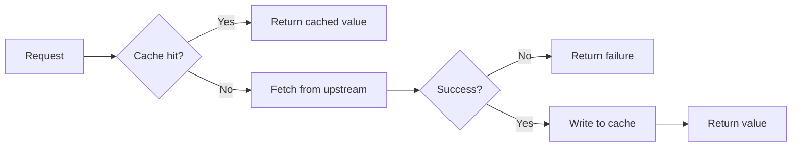

# Redis Caching

> **Cache-Aside Pattern:** A read strategy where the application checks the cache before hitting the primary store and populates it on a miss.

-> Offloading the primary database and delivering sub-millisecond reads for frequently accessed data.

---

## Infrastructure Setup

Redis is registered once in shared infrastructure via `AddStackExchangeRedisCache` with a shared `IConnectionMultiplexer`. If Redis is unreachable at startup the host falls back to `AddDistributedMemoryCache` so the application still starts.

`src/Common/Evently.Common.Infrastructure/InfrastructureConfiguration.cs`

```csharp
IConnectionMultiplexer connectionMultiplexer = ConnectionMultiplexer.Connect(redisConnectionString);
services.AddSingleton(connectionMultiplexer);
services.AddStackExchangeRedisCache(options =>
    options.ConnectionMultiplexerFactory = () => Task.FromResult(connectionMultiplexer));

services.TryAddSingleton<ICacheService, CacheService>();
```

`CacheService` is registered as a Singleton. `TryAddSingleton` protects the registration from accidental overrides in downstream modules.

---

## CacheService

`CacheService` wraps `IDistributedCache` and handles all binary serialization. Callers work with typed objects and never touch raw bytes.

`src/Common/Evently.Common.Infrastructure/Caching/CacheService.cs`

```csharp
internal sealed class CacheService(IDistributedCache cache) : ICacheService
{
    public async Task<T?> GetAsync<T>(string key, CancellationToken cancellationToken = default)
    {
        byte[]? bytes = await cache.GetAsync(key, cancellationToken);
        return bytes is null ? default : Deserialize<T>(bytes);
    }

    public Task SetAsync<T>(string key, T value, TimeSpan? expiration = null, CancellationToken cancellationToken = default)
    {
        byte[] bytes = Serialize(value);
        return cache.SetAsync(key, bytes, CacheOptions.Create(expiration), cancellationToken);
    }

    public Task RemoveAsync(string key, CancellationToken cancellationToken = default) =>
        cache.RemoveAsync(key, cancellationToken);
}
```

**Serialization** uses `Utf8JsonWriter` over an `ArrayBufferWriter<byte>` — zero allocation on the write path. `CacheOptions.Create` resolves the optional expiration to `DistributedCacheEntryOptions`. Passing `null` selects the **default expiration** of 2 minutes absolute.

---

## Cache-Aside Usage: PermissionService

The canonical consumer is `PermissionService` in the Ticketing module. Check the cache, return on hit, fetch upstream on miss, write to cache before returning.

`src/Modules/Ticketing/Evently.Modules.Ticketing.Infrastructure/Authorization/PermissionService.cs`

```csharp
internal sealed class PermissionService(
    IRequestClient<GetUserPermissionsRequest> requestClient,
    ICacheService cacheService) : IPermissionService
{
    private static readonly TimeSpan CacheExpiration = TimeSpan.FromMinutes(5);

    public async Task<Result<PermissionsResponse>> GetUserPermissionsAsync(string identityId)
    {
        PermissionsResponse? cached =
            await cacheService.GetAsync<PermissionsResponse>(CreateCacheKey(identityId));

        if (cached is not null)
        {
            return cached;
        }

        Response<PermissionsResponse, Error> response =
            await requestClient.GetResponse<PermissionsResponse, Error>(
                new GetUserPermissionsRequest(identityId));

        if (response.Is(out Response<Error> errorResponse))
        {
            return Result.Failure<PermissionsResponse>(errorResponse.Message);
        }

        if (response.Is(out Response<PermissionsResponse> permissionsResponse))
        {
            await cacheService.SetAsync(
                CreateCacheKey(identityId),
                permissionsResponse.Message,
                CacheExpiration);

            return permissionsResponse.Message;
        }

        return Result.Failure<PermissionsResponse>(NotFound);
    }

    private static string CreateCacheKey(string identityId) => $"user-permissions:{identityId}";
}
```



---

## Conventions

| Rule | Reason |
|---|---|
| Inject `ICacheService`, never `IDistributedCache` | Decouples callers from the serialization strategy |
| Cache key in a private static `CreateCacheKey` method | Prevents scattered inline key strings |
| Expiration as a private static readonly `TimeSpan` field | Makes the TTL visible and easy to change |
| Cache only successful responses | Prevents poisoning the cache with transient error states |
