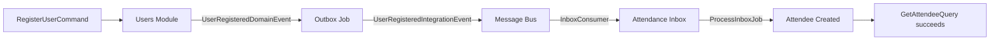

# System Integration Tests

> **Cross-Module Verification:** A test that confirms an action in one module produces the expected side effect in a different module, through the full asynchronous event pipeline.

-> Catching integration failures that module-level tests cannot reach.

---

## What They Test

Module-level integration tests (`Evently.Modules.X.IntegrationTests`) scope each test to a single module in isolation. They verify that a module's own commands, queries, and event handlers work correctly against real infrastructure. They do not cross module boundaries.

**System integration tests** (`Evently.IntegrationTests`) span those boundaries. A test in this project sends a command to module A and asserts that module B reaches the expected state, through the full event pipeline: outbox job, message bus, inbox consumer, and inbox processing job.

---

## Infrastructure Setup

`IntegrationTestWebAppFactory` boots the entire application through `WebApplicationFactory<Program>` backed by real **Testcontainers** instances.

`test/Evently.IntegrationTests/Abstractions/IntegrationTestWebAppFactory.cs`

```csharp
private readonly PostgreSqlContainer _dbContainer = new PostgreSqlBuilder()
    .WithImage("postgres:latest")
    .WithDatabase("evently")
    .Build();

private readonly RedisContainer _redisContainer = new RedisBuilder()
    .WithImage("redis:latest")
    .Build();

private readonly KeycloakContainer _keycloakContainer = new KeycloakBuilder()
    .WithImage("quay.io/keycloak/keycloak:latest")
    .WithResourceMapping(new FileInfo("evently-realm-export.json"), ...)
    .Build();
```

| Container | Purpose |
|---|---|
| PostgreSQL | All module databases |
| Redis | Distributed cache |
| Keycloak | Identity and token validation |

All modules register against the same host. Background jobs (outbox, inbox) run on their normal schedules inside the test process.

---

## Test Base Class

Every system integration test inherits `BaseIntegrationTest`, which resolves an MediatR `ISender` from a fresh DI scope and provides a **Bogus** `Faker` instance for test data generation.

`test/Evently.IntegrationTests/Abstractions/BaseIntegrationTest.cs`

```csharp
public abstract class BaseIntegrationTest : IDisposable
{
    private readonly IServiceScope _scope;
    protected readonly ISender Sender;
    protected readonly Faker Faker = new();

    protected BaseIntegrationTest(IntegrationTestWebAppFactory factory)
    {
        _scope = factory.Services.CreateScope();
        Sender = _scope.ServiceProvider.GetRequiredService<ISender>();
    }
}
```

-> Tests drive the system by sending MediatR commands and queries directly, with no HTTP layer.

---

## The Poller

Cross-module propagation is asynchronous. The outbox job and inbox job run on timers. There is no synchronous callback to await. `Poller.WaitAsync` handles this by retrying a query on a 1-second tick until it succeeds or the timeout expires.

`test/Evently.IntegrationTests/Abstractions/Poller.cs`

```csharp
internal static async Task<Result<T>> WaitAsync<T>(TimeSpan timeout, Func<Task<Result<T>>> func)
{
    using var timer = new PeriodicTimer(TimeSpan.FromSeconds(1));

    DateTime endTimeUtc = DateTime.UtcNow.Add(timeout);
    while (DateTime.UtcNow < endTimeUtc && await timer.WaitForNextTickAsync())
    {
        Result<T> result = await func();

        if (result.IsSuccess)
        {
            return result;
        }
    }

    return Result.Failure<T>(Timeout);
}
```

-> Set the timeout to at least 15 seconds to give the outbox and inbox jobs at least one full cycle each.

---

## Example: RegisterUser_Should_PropagateToAttendanceModule

This test verifies that registering a user in the Users module creates an attendee in the Attendance module.



`test/Evently.IntegrationTests/RegisterUser/RegisterUserTests.cs`

```csharp
[Fact]
public async Task RegisterUser_Should_PropagateToAttendanceModule()
{
    // Register user
    var command = new RegisterUserCommand(
        Faker.Internet.Email(),
        Faker.Internet.Password(6),
        Faker.Name.FirstName(),
        Faker.Name.LastName());

    Result<Guid> userResult = await Sender.Send(command);

    userResult.IsSuccess.Should().BeTrue();

    // Poll until the Attendance module has created the attendee
    Result<AttendeeResponse> attendeeResult = await Poller.WaitAsync(
        TimeSpan.FromSeconds(15),
        async () =>
        {
            var query = new GetAttendeeQuery(userResult.Value);
            return await Sender.Send(query);
        });

    // Assert
    attendeeResult.IsSuccess.Should().BeTrue();
    attendeeResult.Value.Should().NotBeNull();
}
```

| Step | What happens |
|---|---|
| `Sender.Send(command)` | Users module registers user, raises `UserRegisteredDomainEvent`, writes an outbox row |
| Outbox job fires | Publishes `UserRegisteredIntegrationEvent` to the MassTransit bus |
| Inbox consumer fires | Attendance module receives and persists the event to `inbox_messages` |
| Inbox processing job fires | Handler creates the attendee record |
| `Poller.WaitAsync` | Retries `GetAttendeeQuery` every second until the attendee exists or 15 seconds expire |
